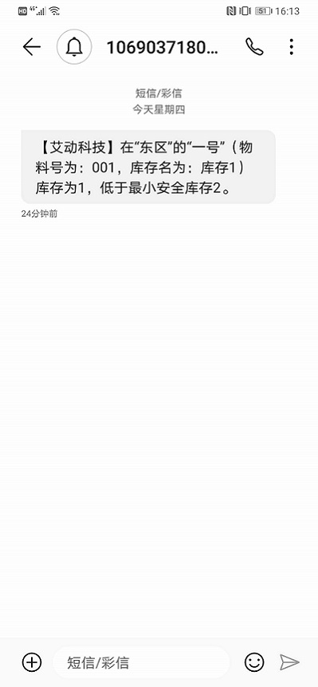

# 3.8.2 发布说明

发布时间：开发中，待定

## 增加的功能

1. [PBIN699：库存消息发送和订阅](#PBIN699：库存消息发送和订阅)

## 修复的问题

## 增加的功能详细说明

### PBIN699：库存消息发送和订阅

* 新增库存消息订阅和发送功能，配置之后，在最小安全库存数量、最大安全库存数量、在库时间发生变化时，在选择了的订阅方式中均会收到消息提示。

* 配置：
  * 首先在EOC端→管理→消息类型管理中，新增了三个内置消息，分别为小于最小安全库存、大于最大安全库存和超过在库时间限制，添加这三个内置消息；
  
    

  * 之后在管理→消息订阅管理中，选择用户订阅这三个消息，请确保该用户在SDC中的用户属性栏填写了邮箱及手机号码；

  * 最后在库存表里需要有相关的库存内容。

* 收到消息提示的周期，在SMC的设置中的服务里配置，如图：

  

> [!warning] 所有的消息只发送一次。

* 完成之后，效果如图：

  
  
  