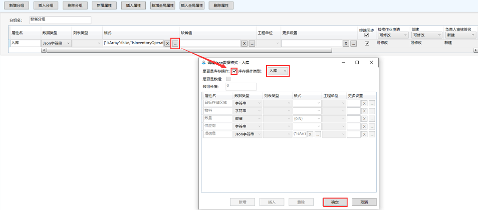
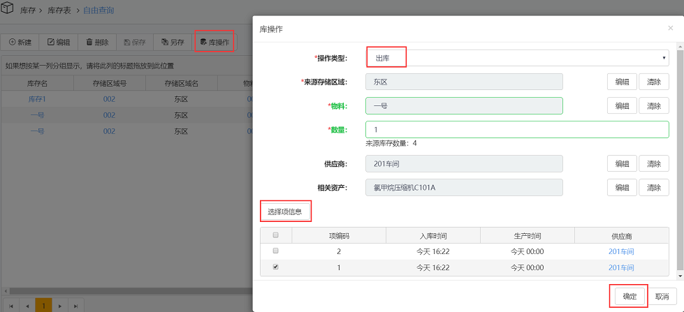

# 3.8.2 发布说明

发布时间：开发中，待定

## 增加的功能

1. [PBIN699：库存消息发送和订阅](#PBIN699：库存消息发送和订阅)
2. [PBIN702：库存表增加超链接](#PBIN702：库存表增加超链接)
3. [PBIN705：库存条目增加资产](#PBIN705：库存条目增加资产)
4. [PBIN708：资产类别和资产关联物料](#PBIN708：资产类别和资产关联物料)
5. [PBIN712：固化常用库存操作](#PBIN712：固化常用库存操作)
6. [PBIN713：EOC支持库存操作](#PBIN713：EOC支持库存操作)
7. [PBIN760：作业组模板支持逻辑文字记录和JSON格式的指定字段](#PBIN760：作业组模板支持逻辑文字记录和JSON格式的指定字段)

## 修复的问题

## 增加的功能详细说明

### PBIN699：库存消息发送和订阅

* 新增库存消息订阅和发送功能，配置之后，在最小安全库存数量、最大安全库存数量、在库时间发生变化时，在选择了的订阅方式中均会收到消息提示。

* 配置：
  * 首先在EOC端→管理→消息类型管理中，新增了三个内置消息，分别为小于最小安全库存、大于最大安全库存和超过在库时间限制，添加这三个内置消息；
  
    

  * 之后在管理→消息订阅管理中，选择用户订阅这三个消息，请确保该用户在SDC中的用户属性栏填写了邮箱及手机号码；

  * 最后在库存表里需要有相关的库存内容。

* 在SMC的设置中的服务里配置中可自行填写轮转周期，如图：

  

> [!warning] 所有的消息只发送一次。

* 完成之后，效果如图：

  
  
  

### PBIN702：库存表增加超链接

* 库存功能加强，库存表增加超链接。超链接的作用在于点击可编辑关联库存表或跳转至关联库存表详情页面，和查看库操作所编辑的项信息。

  

* 库存表中涉及的超链接包括：
  * 存储区域表
    * 操作中点击查看库存，点击跳转至其相关的库存表。
  
  * 物料表
    * 合格供应商来自供应商表，选择适合该物料的合格供应商，点击可对其基本信息进行编辑。
    * 操作中点击查看库存，点击跳转至其相关的库存表。
  
  * 供应商表
    * 操作中点击查看库存，点击跳转至其相关的库存表。
    * 点击查看库存条目，跳转至其相关的库存条目表。
  
  * 库存表
    * 库存名中点击跳转至该库存详情页面，详情页面中项信息点击可查看、新建、编辑、删除项信息，操作中点击查看库存条目可跳转至相关的库存条目表。
    * 存储区域号中点击可打开编辑窗口，可以查看和编辑其中内容。
    * 物料号中点击打开编辑窗口，可以查看和编辑其中内容。
    * 供应商中点击打开编辑窗口，可以查看和编辑其中内容。
    * 项信息点击可查看、新建、编辑、删除项信息。
    * 操作中点击查看库存条目可跳转至相关的库存条目表。
  
  * 库存条目表
    * 物料号中点击打开编辑窗口，可以查看和编辑其中内容。
    * 目标库存名中点击打开编辑窗口，可以查看和编辑其中内容。
    * 目标存储区域号中点击打开编辑窗口，可以查看和编辑其中内容。
    * 资产中点击，跳转至资产总览详情页面。
    * 操作人中点击，跳转至人员总览详情页面。
    * 供应商中点击打开编辑窗口，可以查看和编辑其中内容。
    * 项信息点击可查看项信息，其中供应商点击打开编辑窗口，可以查看和编辑其中内容。
  
  * 物料清单
    * 物料号中点击打开编辑窗口，可以查看和编辑其中内容。
    * 合格供应商来自供应商表，点击可对其基本信息进行编辑。
  
  * 库存导入
    * 导入人点击跳转至人员总览详情页面。
    * 附件点击下载导入的excel文件。

### PBIN705：库存条目增加资产

* 库存条目中增加资产列，资产或资产的资产类别关联物料，进行出库、发货和消耗的库操作后，相关资产会以超链接形式显示，点击可跳转至资产总览详情页面。

### PBIN708：资产类别和资产关联物料

* 新增资产类别和资产关联物料，在SDC资产属性栏中找到库存相关项，如果勾选使用资产类别关联物料，则没有资产关联物料选项，通过资产类别去关联物料即可；如果未勾选，则可以选择资产关联物料，同时，不影响资产类别关联物料。

* 在资产总览视图中，增加了物料履历项，可以查看可用的物料、总成本和进行库操作的情况。

### PBIN712：固化常用库存操作

* 固化了常用库存操作，可以在终端和网页端进行库存操作。
  * 首先在SDC中为作业组配置作业组属性，属性的数据类型为Json字符串类型，在格式中，勾选是否是库存操作，选择库存操作类型，在格式中会自动出来固定的几个属性，总共为来源目标区域、目标存储区域、物料、数量、供应商、资产、项信息。
  * 根据库存操作类型的不同，出现属性组合也不同，不可新增插入和删除。
  * 而后根据终端同步和权限的设置，在网页端新建计划和终端执行时，可以对其进行查看、修改、新建的操作。

    

### PBIN713：EOC支持库存操作

* EOC端支持库存操作，左侧导航选择库存→库存表，进入库存表页面，可以看到库操作选项，点击可以进行库存操作。

  

* 不同的操作类型，其信息选项也会有所不同。比如进行的操作为出库，可以选择关联了相关物料的资产，操作完成后，在资产总览中选择该资产，进入详情页面，其中的物料履历中可以看到对应的操作信息。所有的库操作都可以在库存条目表中查看。

### PBIN760：作业组模板支持逻辑文字记录和JSON格式的指定字段

