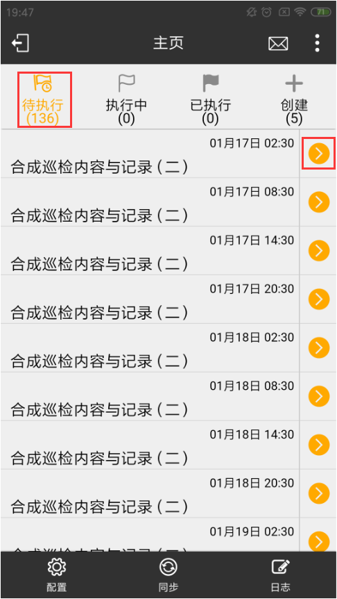

# 主页

* 登录之后主页内容主要分为作业组的状态操作栏，右上角有信息栏和功能菜单。

* 下方选项相对于登录页面，退出项会转变为日志项，用于日志记录。

* 相对于未登录前，配置中会有些不一样：
  + 配置-通用中，登录后会多出一项，无输入节点自动下一步，打开作业组后，在当前节点如作业上如果没有需要操作的，则会自动跳到需要进行操作的下一个节点处。
  + 配置-系统中，会多出一个修改密码项，用以用户修改当面登录密码

* 如果是巡检权限的用户登录，作业组状态操作栏则有待执行、执行中、已执行和创建；如果是有审核权限的用户登录，则会多出一个待审核。
  + 待执行，未开始作业的作业组。
  + 执行中，正在进行作业的作业组。
  + 已执行，已经完成作业，但还未同步至服务器的作业组。
  + 创建，配置了终端可见的即时创建的作业组。
  + 待审核，已经执行同步完，等待审核的作业组。

    
  