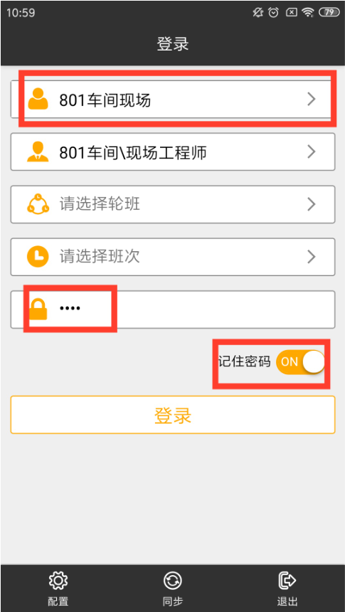
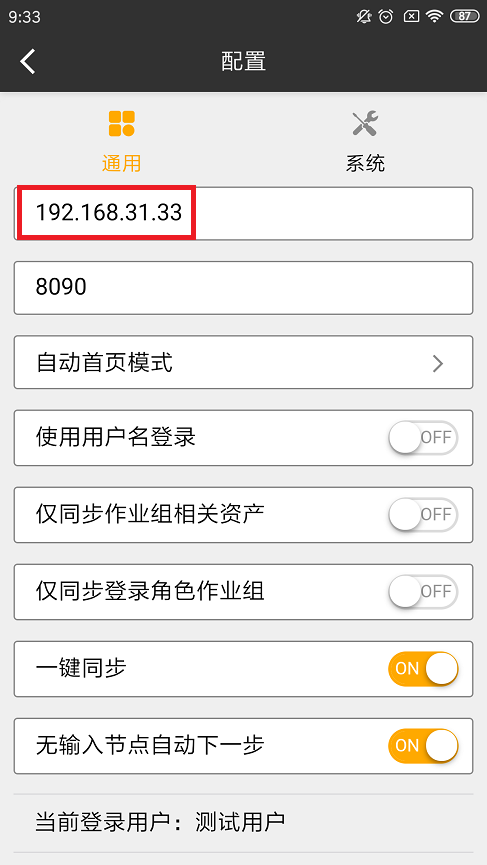
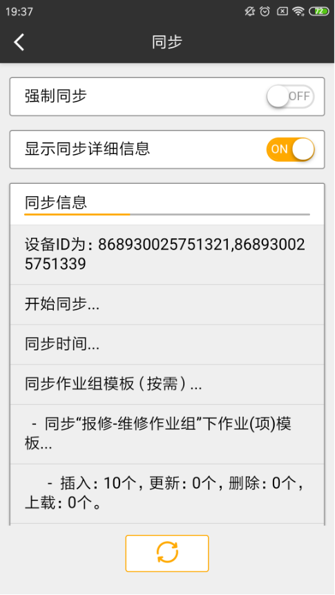

**说明：终端APP用户为执行人员需要安装，通常为巡检，维修，监护等现场工作人员**

## 一. 安装

1. 在imgenius安装包路径下：iDong\iDong imgenius企业移动现场作业管理软件\imMW找到相应的apk文件，拷贝至手机并且安装。

2. 当手机网络处于和服务器相同的内部网络时，可扫描网站-系统移动终端上的二维码下载。

## 二. 服务器连接配置

1. 终端连接配置：

* 通过无线网络WIFI与局域网连接 （终端使用wifi）

* 通过移动运营商，支持4G，3G，GPRS等无线互联网连接（手机使用移动数据流量）

2. 服务器连接配置：

* 获取服务器电脑IP地址（为与手机连接做准备），运行CMD

* 输入命令：ipconfig

* 查看服务器IP地址

## 三. 终端im移动工作站配置：

1. 打开手机上的“im移动工作站”：

2. 下方三个选项的配置里，IP地址改为服务器地址

3. 返回主页面，点击同步，拿到用户数据，选择登陆的用户，选择完输入密码（初始都为1234），同时勾选上记住密码

4. 点击登陆，登陆完点击同步，拿到作业组

5. 点击作业组名称后面的图标，进入作业组，开始作业，点击下方的下一步图标，按顺序完成巡检；

6. 全部完成之后，有网络的情况下，选择完成并同步，无网络情况下选择完成，到有网的地方同步。

