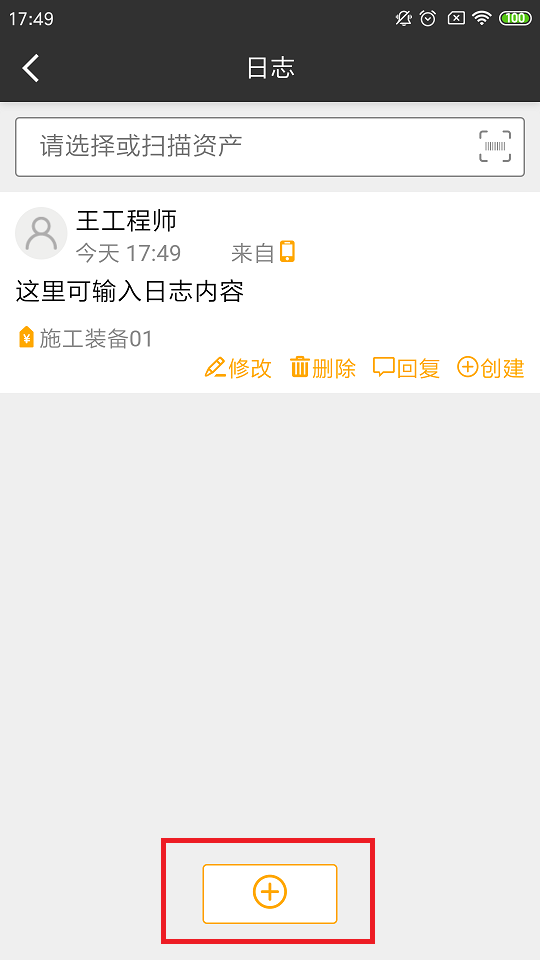

# 配置

## 服务器连接配置

* 终端连接配置：

  + 通过无线网络WIFI与局域网连接 （终端使用wifi）
  + 通过移动运营商，支持4G，3G，GPRS等无线互联网连接（手机使用移动数据流量）

*  服务器连接配置：

   + 获取服务器电脑IP地址（为与手机连接做准备），运行CMD
   + 输入命令：ipconfig

* 查看服务器IP地址

## 终端im移动工作站配置：

* 打开手机上的“im移动工作站”：

  

* 下方三个选项的配置里，IP地址改为服务器地址

  