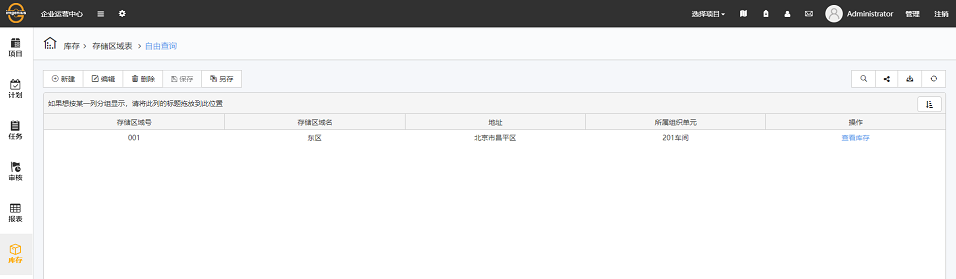
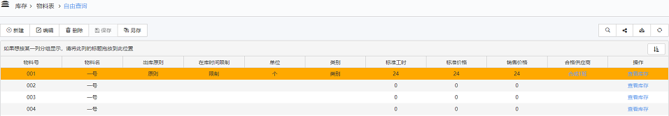
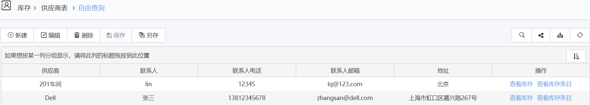
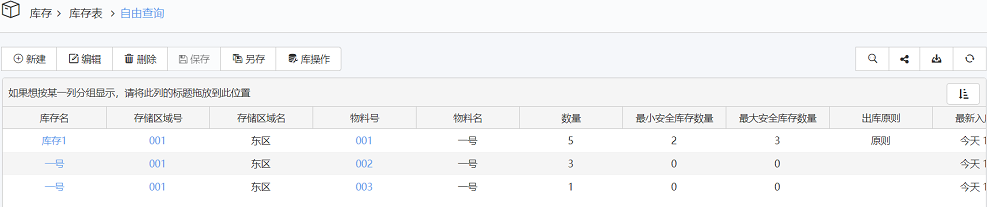
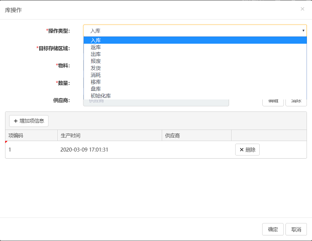

# 库存

库存，是仓库中实际储存的货物。可以分两类：一类是生产库存，即直接消耗物资的基层企业、事业的库存物资，它是为了保证企业、事业单位所消耗的物资能够不间断地供应而储存的；一类是流通库存，即生产企业的原材料或成品库存，生产主管部门的库存和各级物资主管部门的库存。此外，还有特殊形式的国家储备物资，它们主要是为了保证及时、齐备地将物资供应或销售给基层企业、事业单位的供销库存。

库存页面提供给用户准确详细的相关数据，包括存储区域表、物料表、供应商表、库存表、库存条目表，另外还有库存导入。

## 存储区域表

* 库存区域是库存所在，其概要信息包括了存储区域号（不可重复）、存储区域名、地址以及所属组织单元。同时，提供查看库存操作。编辑页面可编辑所有的相关信息。

  

* 视图
  * 新建：新建库存信息。
  * 编辑：选中一行，编辑库存信息。
  * 保存：保存至导航栏当前查询。
  * 另存为：在导航栏内选择文件夹新建查询保存。
  * 导出：将当前库存内容导出至Excel。
  * 查询：设置自定义查询条件，可与筛选器配合使用，即在筛选器条件基础上添加自定义条件。
  * 刷新：刷新当前列表视图显示。

* 概要信息
  * 存储区域号，库存所在存储区域的编号，具有唯一性，不可以重复。
  * 存储区域名，库存所在存储区域的名称。
  * 地址：库存所在存储区域的详细地址。
  * 所属组织单元：存储区域所属的组织单元。
  * 操作：查看库存，点击跳转至库存表。

* 存储区域可以属于另一个存储区域，在编辑存储区域时可选。

## 物料表

* 物料表列出了包括除产品、固定资产之外的一切实物形式的物品材料信息。

  

* 概要信息
  * 物料号：物料的编号，不可以重复插入。
  * 物料名：物料的名称。
  * 出库原则：指定该物料出库时的原则。
  * 在库时间限制：预设物料的在库时间。
  * 单位：物料的单位。
  * 类别：物料的类别。
  * 标准工时：在标准工作环境下，进行一道加工工序所需的人工时间。
  * 标准价格：在标准情况下物料的价格。
  * 销售价格：在销售时为物料定下的价格。
  * 合格供应商：来自供应商表，选择适合该物料的合格供应商。
  * 操作：查看库存，点击跳转至库存表。

## 供应商表

* 供应商表列出了向用户提供各种库存所需的企业或者个人的详细信息。当新建时，新建页面默认为关联一个组织单元，点击选择对应组织单元，那么该组织单元名即为供应商名。也可选择不关联组织单元，自行填写供应商名称。

  

* 概要信息
  * 供应商：供应商的名称，关联组织单元时为组织单元名。
  * 联系人：该供应商联系人的名字。
  * 联系人电话：该供应商联系人的电话。
  * 联系人邮箱：该供应商联系人的邮箱。
  * 地址：供应商的地址。
  * 操作：查看库存，点击跳转至库存表；查看库存条目，点击跳转至库存条目表。

## 库存表

* 库存表列出了当前库存的所有详细信息，包含了存储区域、物料、供应商的相关信息，库存表将这三个表中的信息整合对应起来，形成一种库存。

  

* 视图
  * 库操作
    * 针对于当前库存进行相应的操作，基础操作为选择操作类型、目标存储区域、物料、数量以及供应商；同时可增删改该库存的项信息，为项信息填写编码、生成时间和供应商。

      

* 概要信息
  * 库存名：库存的名称。
  * 存储区域号：该库存所在的存储区域编号。
  * 存储区域名：该库存所在的存储区域名称。
  * 物料号：库存物料编号。
  * 物料名：库存物料名称。
  * 数量：库存数量。
  * 最小安全库存数量：需要及时补充库存时的数量。
  * 最大安全库存数量：无法满足库存可继续增加时的数量。
  * 出库原则：库存出库时的原则。
  * 最新入库时间：最新库存入库的时间。
  * 最久入库时间：最久的库存入库时间。
  * 在库时间限制：限制库存的在库时间。
  * 供应商：该库存的供应商。
  * 项信息：点击超链接可增删改查看进行库操作后为库存增加的项信息。
  * 操作：查看库存条目，点击跳转至库存条目表。

* 其中，当库存数量小于最小安全库存、大于最大安全库存和库存时间超过在库时间限制时，如果订阅了该消息，订阅方式中会收到相应信息，该信息只发送一次。

## 库存条目表

