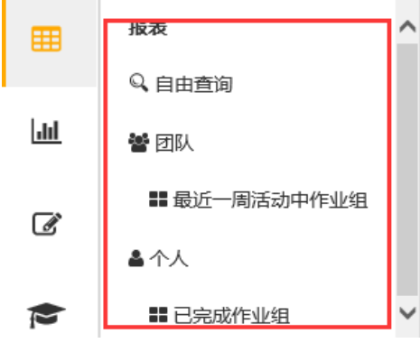
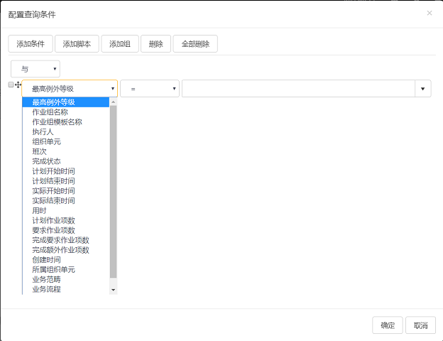
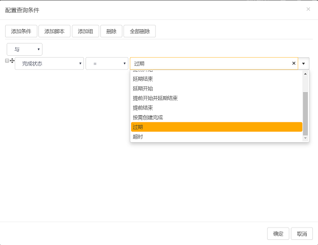

# 报表

报表页面提供给用户所关心的现场作业情况的报表，供用户查看和分析。报表页面右侧为筛选器，允许用户根据不同的条件对报表列表进行筛选，以在中间报表视图中列出自己感兴趣的报表数据，还允许用户将筛选条件或个性查询保存至导航栏便于应用。

## 报表类型

* 页面右上角“活动中作业组”按钮点击可显示报表清单，有十四种报表类型：

  * 活动中作业组
    * 所有还处于业务流程中的作业组总览报表，给出这些作业组的概要信息。这些作业组并未结束归档。
  * 归档作业组
    * 所有已经在业务流程中结束的作业组总览报表，给出这些作业组的概要信息。
  * 作业组报表
    * 所用流程活动中结束，未结束的作业组总览报表，给出这些作业组概要信息。
  * 我的作业组
    * 所有作业组中当前登录用户参与过活动的作业组。
  * 例外作业（项）
    * 所有归档作业组中发生例外的作业项。
  * 未完成作业（项）
    * 所有作业组中没有完成的作业（项）。
  * 作业项报表
    * 作业项报表向用户提供所选作业项的当前值列表。
  * 作业项历史报表
    * 作业项历史报表向用户提供所选时间范围内符合条件的全部作业项历史列表。
  * 资产状态
    * 资产状态报表向用户提供资产（应用状态检查）的当前设备状态。
  * 资产状态时序图
    * 针对所有归档的作业组，根据资产在不同作业中的状态，按时间给出的状态变化图。
  * 资产属性报表
    * 资产属性报表向用户提供所选资产关联的资产类别属性的当前值。
  * 资产属性历史报表
    * 资产属性历史报表向用户提供所选时间范围内符合条件的全部资产属性历史列表。
  * 资产作业活动报表
    * 跟资产相关活动中的作业组。
  * 资产作业历史活动报表
    * 跟资产相关的已归档的作业组。

## 各类型报表说明

> [!warning] 报表中的各项说明中，导航以活动中作业组为例，之后的报表类型不再做说明。报表视图、筛选器和概要信息如无不同，也不再做说明。

### 活动中作业组

* 活动中作业组列出所有业务流程未结束的作业组，其筛选器预设四种查询的筛选条件，分别为：我的作业、计划时间、开始时间、例外等级，中间活动中报表视图设有自定义查询功能，允许用户自定义过滤规则，还可以将查询出的报表导出至Excel。

  * 导航
    * 存储活动中作业组个性查询的文件夹，方便团队和个人今后使用。

    

    * 团队：可按组织单元定义文件夹，仅所属组织单元用户有权访问
    * 使用：不配置组织单元则所有人开放。
    * 个人：仅登录用户个人使用。
    * 自由查询：将查询条件重置回筛选器缺省设置。
  
  * （活动中作业组）报表视图
    * 以列表显示符合过滤条件的活动中作业组报表及其概要信息。点击列表中作业组名称，可进入查看该作业组的详细信息。活动中作业组报表视图缺省显示符合“计划时间-全部，开始时间-最近2周”的作业组。其中：
      * 保存：保存至导航栏当前查询。
      * 另存为：在导航栏内选择文件夹新建查询保存。
      * 导出：将当前报表视图内容导出至Excel。
      * 查询：设置自定义查询条件，可与筛选器配合使用，即在筛选器条件基础上添加自定义条件。
      * 刷新：刷新当前列表视图显示。

  * (活动中作业组）筛选器
    * 提供我的作业、计划时间、开始时间、例外等级四种过滤规则，可复选过滤规则，我的作业和例外等级内过滤项可多选，多项过滤项间应用或运算，即满足其一就为符合条件。其他过滤规则之间叠加，应用“与”运算，即应同时满足所选过滤项。“计划时间-全部，开始时间-最近2周”为活动中作业组缺省设置。
      * 我的作业：依据作业组关联的用户来划分，其下有七个过滤项，分别为：待执行、待审核、已创建、已计划、已执行、已审核、全部。待执行、待审核、已创建、已计划、已执行、已审核等六个过滤项仅针对当前登录用户，即与当前登录用户关联的作业组。全部过滤项则显示全部活动中作业组（包含其他用户）。我的作业下过滤项可多选，取其并集。我的作业无缺省设置项。
      * 计划时间：依据作业组计划的时间来划分，用户可以选择适当的时间范围，其下过滤项为单选。
      * 开始时间：依据作业组实际开始执行的时间来划分，用户可以选择适当的时间范围，其下过滤项为单选。
      * 例外等级：依据作业组的最高例外等级来划分，其下过滤项可以多选。

  * 报表概要信息
    * 活动中作业组报表的各列表项字段的信息说明如下：
      *  ：该作业项发生的例外等级，以配置的例外等级图标标识。如没有配置相关图标，以标识。当有多个例外发生时，以最高等级的例外等级图标标识。
      * 作业组名称：配置的作业组名称。
      * 执行人：在手持终端上执行该作业组的人员的用户名。如有多个执行人共同完成一个作业组，按顺序列出。
      * 组织单元：执行人所在组织单元。如有多个执行人，将相应列出这些执行人所在的组织单元。
      * 班次：列出执行人登录时选择的班次信息，适用于为其组织单元分配了轮班制度的执行人。
      * 完成状态：该作业组与计划相比的完成状态。
      * 计划开始时间：该作业组的计划开始时间，如果是按需创建的作业组将为空。
      * 计划结束时间：该作业组的计划结束时间，如果是按需创建的作业组将为空。
      * 实际开始时间：在手持终端上实际开始执行该作业组的时间，如果是多人共同完成，按最早的开始时间。
      * 实际结束时间：在手持终端上实际结束该作业组的时间，如果是多人共同完成，按最后的结束时间。
      * 用时：执行该作业组的实际耗时。
      * 计划作业项数：该作业组在计划时的所有要求作业项的数量。
      * 要求作业项数：该作业组实际执行过程中的所有要求作业项的数量。如果该数量与计划作业项数不一致，通常是因为在作业执行的过程中，根据现场的数据和作业逻辑对于某些作业状态进行了动态改变。
      * 完成要求作业项数：所有完成的要求作业项数。
      * 完成额外作业项数：所有完成的不要求作业的作业项数。所有按需创建的作业组下的作业项都视为额外作业项。
      * 创建时间：该作业组实例创建的时间。如果是计划的作业组，为系统自动创建的时间。如果是按需创建的作业组，为手持终端上创建该作业组的时间。
      * 当前状态：该作业组在业务流程中的当前状态，表示完成的活动和有待进行的活动。
      * 业务范畴：该作业组所属的业务范畴。
      * 业务流程：该作业组所属的业务流程。
      * 最后修改时间：该作业组的最后修改的时间。

### 归档作业组

* 归档作业组列出所有业务流程中已经结束的作业组，筛选器预设三种查询的筛选条件，中间归档作业组报表视图设有自定义查询功能，允许用户自定义过滤规则，还可以将查询出的报表导出至Excel。

  * （归档作业组）筛选器
    * 提供计划时间、开始时间、例外等级三种过滤规则，可复选过滤规则，例外等级内过滤项可多选，多项过滤项间应用或运算，即满足其一就为符合条件。其他过滤规则之间叠加，应用“与”运算，即应同时满足所选过滤项，“计划时间-全部，开始时间-最近2周”为归档作业组缺省设置。

### 作业组报表

* 所用流程活动中结束，未结束的作业组总览报表，给出这些作业组概要信息。筛选器预设四种查询的筛选条件，中间作业组报表视图设有自定义查询功能，允许用户自定义过滤规则，还可以将查询出的报表导出至Excel。
  * （作业组报表）筛选器
    * 提供规定状态、计划时间、开始时间、例外等级四种过滤规则，可复选过滤规则，例外等级内过滤项可多选，多项过滤项间应用或运算，即满足其一就为符合条件。其他过滤规则之间叠加，应用“与”运算，即应同时满足所选过滤项，“规定状态，计划时间-全部，开始时间-最近2周”为归档作业组缺省设置。
      * 归档状态：依据作业组的状态来划分。
  * 报表概要信息
    * 归档时间：该作业流程流程结束的时间。

### 我的作业组

* 我的作业组列出了所有当前登录用户参与过活动的作业组，其筛选器预设四种查询的筛选条件，分别为：归档状态、我的作业、计划时间、开始时间、例外等级，中间我的作业组视图设有自定义查询功能，允许用户自定义过滤规则，还可以将查询出的报表导出至Excel。
  * （我的作业组）筛选器
    * 归档状态：依据作业组的状态来划分

### 例外作业（项）

* 例外作业（项）列出了所有已归档作业组中发生了例外的作业项。所谓发生了例外的作业项，定义为关联了例外等级的作业项逻辑。针对例外作业项，其筛选器预设三种筛选条件，中间例外作业（项）报表视图设有自定义查询功能，允许用户自定义过滤规则，还可以将查询出的报表导出至Excel。
  * （例外作业（项）报表）筛选器
    * 录入时间：依据例外作业（项）值录入时间来过滤。
    * 相关业务范畴：依据该例外作业（项）的相关业务范畴来过滤。

### 未完成作业（项）

* 未完成作业（项）向用户提供未完成作业（项）。其筛选器预设两种查询的筛选条件，中间作业项报表视图设有自定义查询功能，允许用户自定义过滤规则，还可以将查询出的报表导出至Excel。

### 作业项报表

* 作业项报表向用户提供所选作业项的当前值列表。其筛选器预设两种查询的筛选条件，中间作业项报表视图设有自定义查询功能，允许用户自定义过滤规则，还可以将查询出的报表导出至Excel。
  * （作业项报表）筛选器
    * 提供作业组\作业规范两种数据选择范围，选择范围不可叠加使用，数据选择范围内作业项可多选但仅限于同一作业下，多个作业项间应用或运算，即满足其一就为符合条件。
      * 作业组:按照选定的作业组下的作业项来查看报表。
      * 作业规范:按照选定的作业规范下的作业项来查看报表。

### 作业项历史报表

* 作业项历史报表向用户提供所选时间范围内符合条件的全部作业项历史列表。其筛选器预设两种查询的筛选条件，中间作业项报表视图设有自定义查询功能，允许用户自定义过滤规则，还可以将查询出的报表导出至Excel。
  * （作业项历史报表）筛选器
    * 提供作业组、作业规范两种数据选择范围，数据选择范围不可叠加使用，数据选择范围内过滤项可多选但仅限于同一作业下，多个作业项间应用或运算，即满足其一就为符合条件。
      * 作业组：按照选定的作业组下的作业项来查看报表。
      * 作业规范：按照选定的作业规范下的作业项来查看报表。

### 资产状态

* 资产状态报表向用户提供资产（应用状态检查）的当前设备状态，如运行、备用、检修、停止等。其筛选器预设四种查询的筛选条件，中间活动中报表视图设有自定义查询功能，允许用户自定义过滤规则，还可以将查询出的报表导出至Excel。
  * （资产状态）筛选器
    * 提供资产、资产类别、状态列表、作业四种过滤规则，可叠加过滤规则，过滤规则内过滤项可多选，四种过滤规则之间叠加，应用“与”运算，即应同时满足所选过滤项。
      * 资产：依据所选资产来过滤。
      * 资产类别：依据所选资产类别来过滤。
      * 状态列表：依据所选状态列表来过滤。
      * 作业：依据所选作业来过滤。
  * 报表概要信息
    * 资产名称：配置的关联资产名称。
    * 资产类别：所属资产类别名称。
    * 作业名称：关联资产的作业名称。
    * 作业状态：资产当前设备状态。
    * 作业组名称：所在的作业组名称。
    * 时间：设备状态录入时间。
    * 作业状态列表：状态检查应用的自定义列表名称。

### 资产状态时序图

* 资产状态时序图向用户提供所选资产的状态时序图。其筛选器预设资产筛选条件。

### 资产属性报表

* 资产属性报表向用户提供所选资产关联的资产类别属性的当前值。其筛选器预设两种查询的筛选条件，中间资产属性报表视图设有自定义查询功能，允许用户自定义过滤规则，还可以将查询出的报表导出至Excel。
  * （资产属性报表）筛选器
    * 提供资产类别、资产两种过滤规则，可叠加过滤规则，过滤规则内过滤项可多选，多项过滤项间应用或运算，即满足其一就为符合条件。过滤规则之间叠加，应用与运算，即应同时满足所选过滤项。
      * 资产类别：依据所选资产类别的资产类别属性来过滤。,资产属性，包含在资产类别下，为资产属性报表筛选器的必选条件。
      * 资产：依据所选的资产来过滤。

  * 报表概要信息
    * 资产：配置的资产名称。
    * 资产类别：所属资产类别名称。
    * 属性名称：关联的资产属性名称。
    * 属性类型：关联的资产属性的数据类型。
    * 值：当前的资产属性值。
    * 更新人：更新该资产属性值的用户名，允许在手持终端上录入和企业运营中心更新该值。
    * 更新时间：资产属性值的更新时间。

### 资产属性历史报表

* 资产属性历史报表向用户提供所选时间范围内符合条件的全部资产属性历史列表。其筛选器预设两种查询的筛选条件，中间资产属性历史报表视图设有自定义查询功能，允许用户自定义过滤规则，还可以将查询出的报表导出至Excel。

### 资产作业活动报表

* 资产作业活动报表向用户提供到今天为止全部在活动中的资产作业列表。其筛选器预设四种查询的筛选条件，资产作业活动报视图设有自定义查询功能，允许用户自定义过滤规则，还可以将查询出的报表导出至Excel。

### 资产作业历史报表

* 资产作业历史报表向用户提供全部资产作业历史列表。其筛选器预设四种查询的筛选条件，资产作业活动报视图设有自定义查询功能，允许用户自定义过滤规则，还可以将查询出的报表导出至Excel。

## 报表查询

* 报表视图的查询允许用户自定义针对当前报表类型的任何查询，用以满足个性化的数据应用。
  * 报表视图中配置查询
    * （以归档作业组为例）查询过期的作业组。在报表视图中点击查询，弹出配置查询条件窗口。

      

    * 在配置查询条件窗口点击“添加条件”，针对查询条件，允许用户对一些特定字段作为条件进行查询。选择其中一项“完成状态”，如图：

      

    * 修改条件为：完成状态 = 过期，如图：

      

    * 配置完成后确定，系统将自动筛选查询结果。
