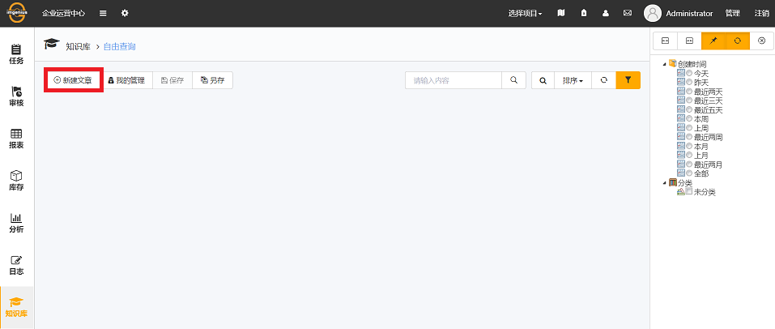
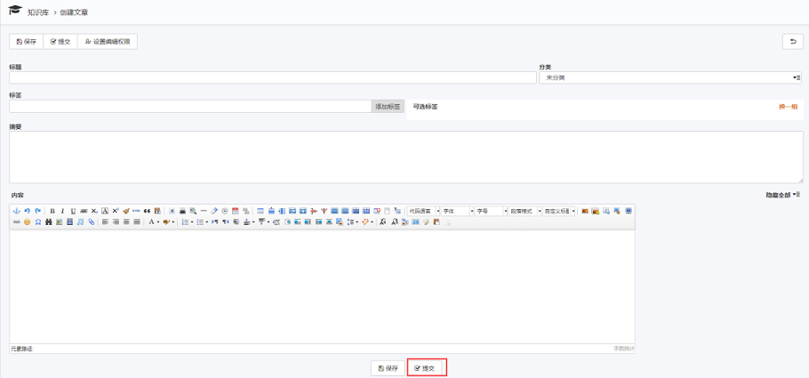

# 知识库

知识库是imgenius企业移动现场作业管理系统提供的一个基于网页、面向用户的积累企业知识文化，分享传承工作经验的应用平台。知识库可以帮助企业建立企业知识结构、分类存储知识数据、共享知识应用、提升企业管理效率、增值企业知识资产。

## 新建文章

* 进入企业运营中心，单击知识库，选择新建知识库文章，如图：

  

  * 新建一篇知识库文章
    * 选择新建知识库文章后，系统进入创建文章界面。
      * 标题：为本次建立的知识库文章起一个标题，可用于搜索。
      * 分类：可以将知识库文章分类，例如机械类，电气类。
      * 标签：为本次建立的知识库文章添加一个标签，可用于搜索。
      * 摘要：叙述本次建立的知识库文章的重点，概述等，可用于搜索。
      * 正文：录入本次知识库文章的主要内容，可用于搜索。

  * 发布文章
    * 文章编写完成后，用户可以选择导航栏的发布按钮发布文章，也可以在编辑文章底部单击提交。

      