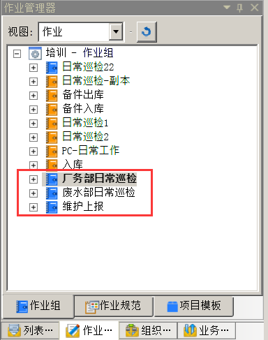
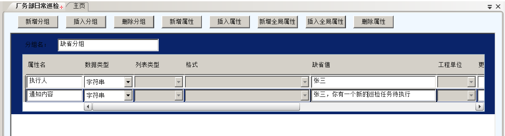

# 社交平台集成示例-作业任务钉钉推送


## 配置钉钉机器人
* 登录钉钉app，进入需要添加机器人的钉钉群，如下图：


* 点击右上角三点“...”，点击“智能群助手”,如下图：


* 点击“添加机器人”


* 选择机器人“webhook”


* 添加机器人后，根据业务需求选择对应的“安全设置”，并点击“完成”


* 复制机器人的“webhook”，用于流程后函数的开发


## 配置idong流程

* 按照实际业务需求配置流程，如下图：


* 导出流程


* 复制触发流程后函数的流程节点（如：“值班长审核”）的id


## 流程后函数中如何对接钉钉

* 流程后函数主要语言为node.js，代码中url为钉钉机器人的webhook

```js
var url = 'https://oapi.dingtalk.com/robot/send?access_token=0ebbb34c209255bb2010f6dafc900dd3d43ee23884c92dd8b9e16ca230a11442';

function HttpRequest(url,requestData){
    request({
        url: url,
        method: "POST",
        json: true,
        headers: {
            "content-type": "application/json",
        },
        body: requestData
    }, function(error, response, body) {
        if (!error && response.statusCode == 200) {
            console.log(body) // 请求成功的处理逻辑
        }
    });
}
```

其中，body部分为钉钉的消息类型及数据格式,示例（纯文本类型）如下

```js
{
    “ msgtype”：“ text”， 
    “文字”：{
        “ content”：“我就是我，是不一样的烟火@ 156xxxx8827”
    }， 
    “在”：{
        “ atMobiles”：[
            “ 156xxxx8827”， 
            “ 189xxxx8325”
        ]， 
        “ isAtAll”：false
    }
}
```
* 其他示例参照                ：https://ding-doc.dingtalk.com/doc#/serverapi3/iydd5h


## 编写配置文件

1. 配置需要通知的作业组及流程相关信息
* `taskGroupName`作业组名字

* `BusinessProcessName` 流程名字

* `ActivityEntityName` 活动节点名

2. 配置通知人员信息

* `Type` 类型，`0` 表示默认不@任何人；`1` 表示来自作业组属性值，作业组需建立@“执行人”的作业组属性。

* `taskgroupPropertyName` 作业组属性名，Type值等于`1`时，此项才有效

3. 配置通知内容

* `Type`  `0`表示默认作业组名+活动节点名；`1`来自作业组属性值，作业组需建立“通知内容”相关的作业组属性，并在属性值添加相应通知内容

* `taskgroupPropertyName` 作业组属性名

4. 配置钉钉机器人URL

* `Robot` 钉钉机器人URL，如有多个用逗号隔开

配置文件：
```js
{
 "config":[
 {
  "BusinessProcessInfo":[
 
  {
   "taskGroupName":"作业组1",
   "BusinessProcessName":"流程1",
   "ActivityEntityName":"执行1"
  },
  {
   "taskGroupName":"作业组2",
   "BusinessProcessName":"流程2",
   "ActivityEntityName":"执行2"
  }
  ],
  "Message":{
   "MobilePhoneArray":{
   "Type":0,
   "taskgroupPropertyName":"执行人"
   },
   "Text":{
   "Type":0,
   "taskgroupPropertyName":"通知内容"
   }
  },
  "Robot":["","",""]
 }
 ]
}
```
## demo示例

* 作业组配置

添加三个作业组，分别为**日常巡检任务，日常巡检，维修上报**，如图



为**日常巡检任务，日常巡检**两个作业组配置同一个流程：**日常巡检流程**；为**维修上报**作业组配置**维修上报**流程。

为这些作业组添加两个作业组属性：“**执行人**”和“**通知内容**”。

以日常巡检任务为例，作业组属性如下配置：

**执行人**：**字符串**类型，**缺省值**为张三

**通知内容**：**字符串**类型，**缺省值**为张三，你有一个新的日常巡检任务待执行

如图：



另外两个作业组相同如上配置。

* 创建流程

分别创建两个日常巡检流程，维修流程

维修流程如图：


巡检流程如图：


* 配置配置文件
```js
{
 "config":[
 {
  "BusinessProcessInfo":[
 
  {
   "taskGroupName":"日常巡检任务",
   "BusinessProcessName":"日常巡检流程",
   "ActivityEntityName":"执行"
  },
  {
   "taskGroupName":"日常巡检任务",
   "BusinessProcessName":"日常巡检",
   "ActivityEntityName":"执行"
  }
  ],
  "Message":{
   "MobilePhoneArray":{
   "Type":1,
   "taskgroupPropertyName":"执行人"
   },
   "Text":{
   "Type":1,
   "taskgroupPropertyName":"通知内容"
   }
  },
  "Robot":["https://oapi.dingtalk.com/robot/send?access_token=0ebbb34c209255bb2010f6dafc900dd3d43ee23884c92dd8b9e16ca230a11442"]
 }
 ]
}
```