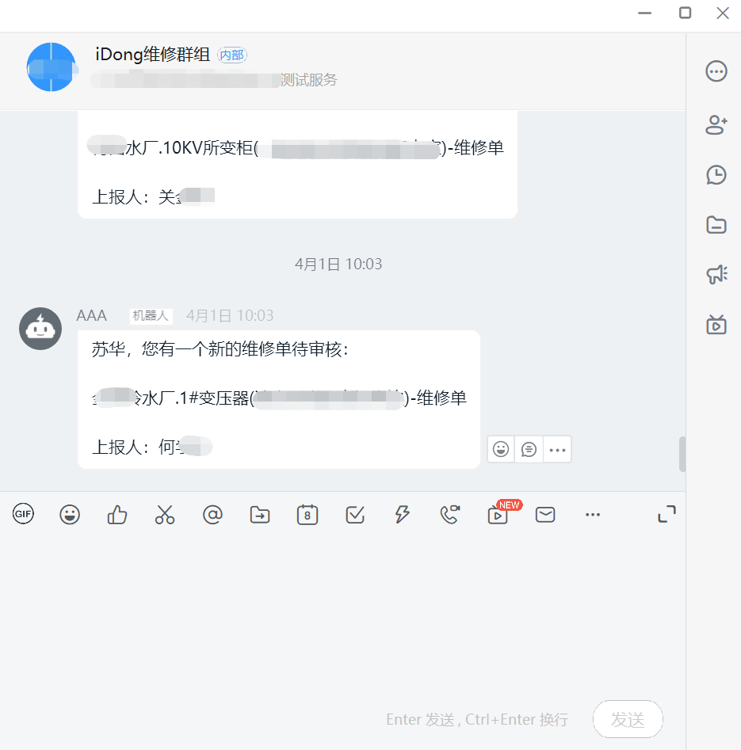
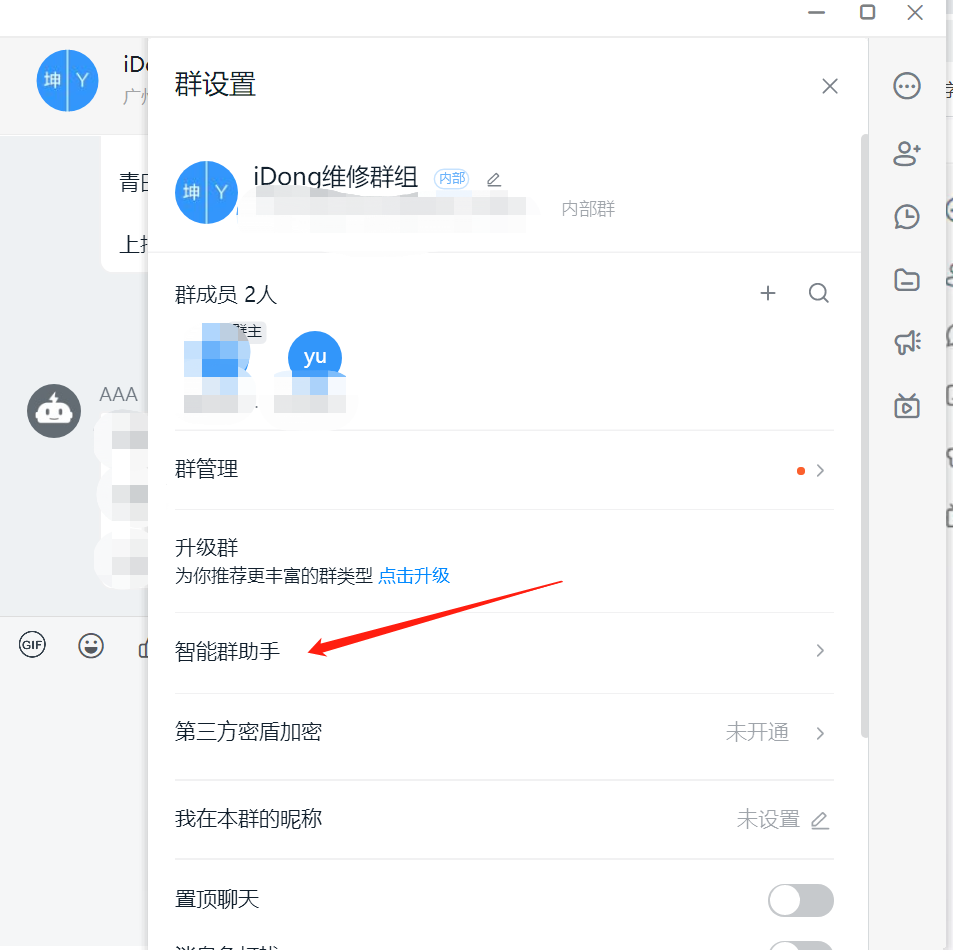
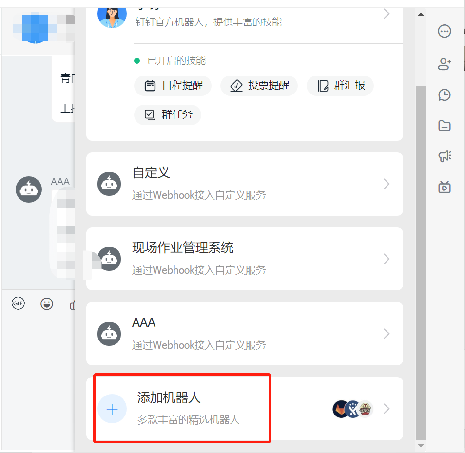

# 社交平台集成示例-作业任务钉钉推送


## 配置钉钉机器人
* 登录钉钉app，进入需要添加机器人的钉钉群，如下图：


* 点击右上角三点“”，点击“智能群助手”,如下图：


* 点击“添加机器人”


* 选择机器人“webhook”


* 添加机器人后，根据业务需求选择对应的“安全设置”，并点击“完成”


* 复制机器人的“webhook”，用于流程后函数的开发


## 配置idong流程

* 按照实际业务需求配置流程，如下图：


* 导出流程


* 复制触发流程后函数的流程节点（如：“值班长审核”）的id


## 流程后函数中如何对接钉钉

* 流程后函数主要语言为node.js，代码中url为钉钉机器人的webhook

```js
var url = 'https://oapi.dingtalk.com/robot/send?access_token=0ebbb34c209255bb2010f6dafc900dd3d43ee23884c92dd8b9e16ca230a11442';

function HttpRequest(url,requestData){
    request({
        url: url,
        method: "POST",
        json: true,
        headers: {
            "content-type": "application/json",
        },
        body: requestData
    }, function(error, response, body) {
        if (!error && response.statusCode == 200) {
            console.log(body) // 请求成功的处理逻辑
        }
    });
}
```

其中，body部分为钉钉的消息类型及数据格式,示例（纯文本类型）如下

```js
{
    “ msgtype”：“ text”， 
    “文字”：{
        “ content”：“我就是我，是不一样的烟火@ 156xxxx8827”
    }， 
    “在”：{
        “ atMobiles”：[
            “ 156xxxx8827”， 
            “ 189xxxx8325”
        ]， 
        “ isAtAll”：false
    }
}
```
* 其他示例参照                ：https://ding-doc.dingtalk.com/doc#/serverapi3/iydd5h


