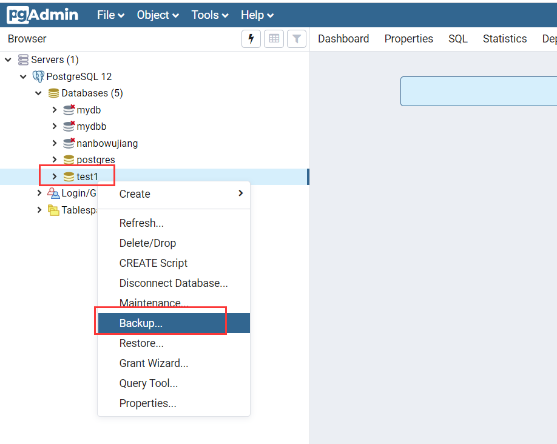
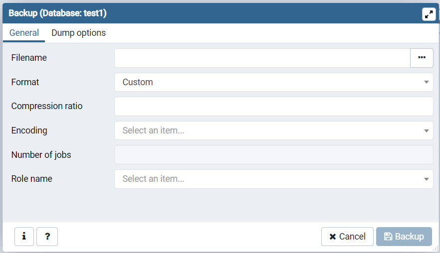
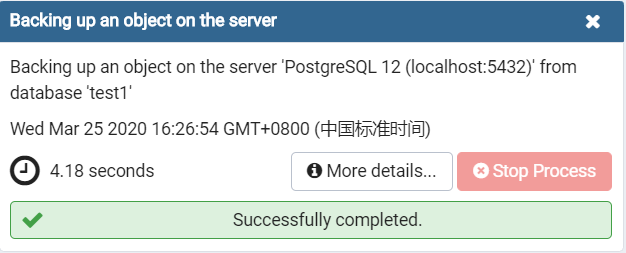
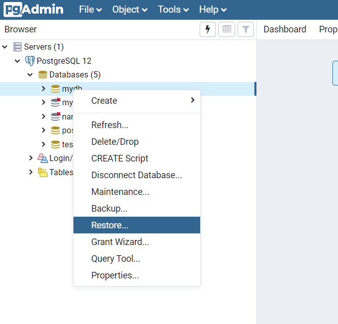
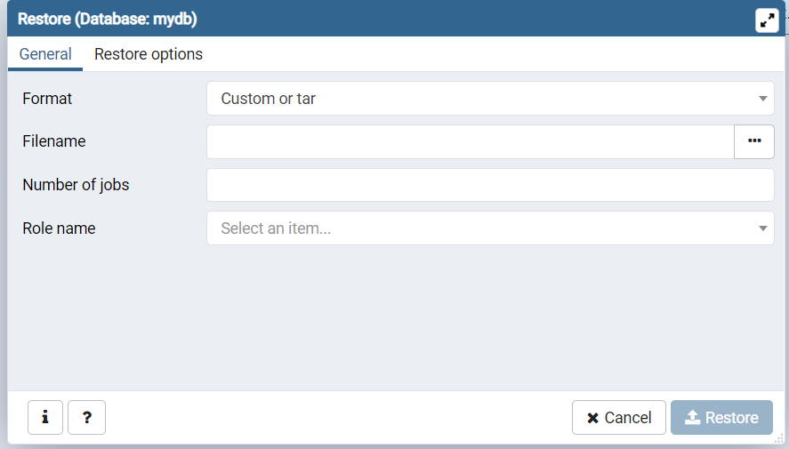
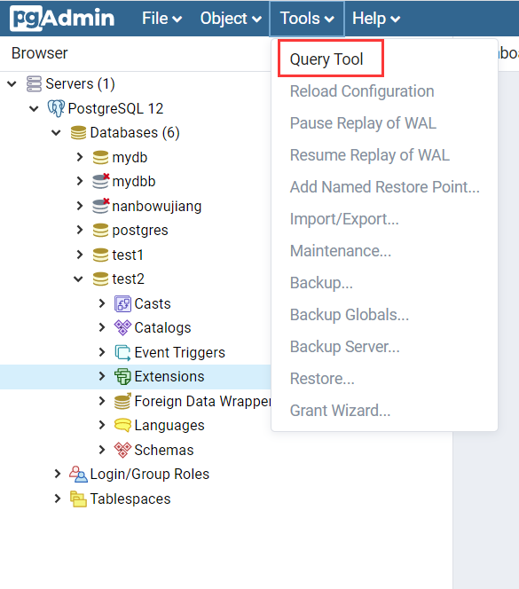
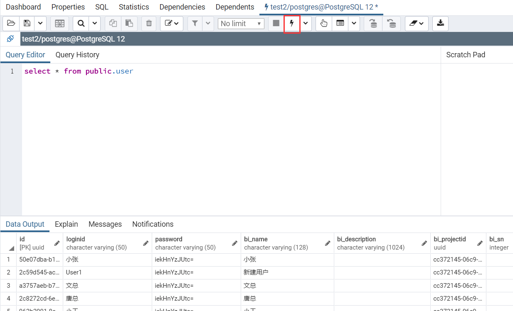
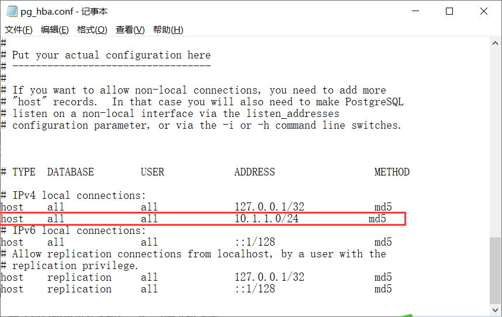
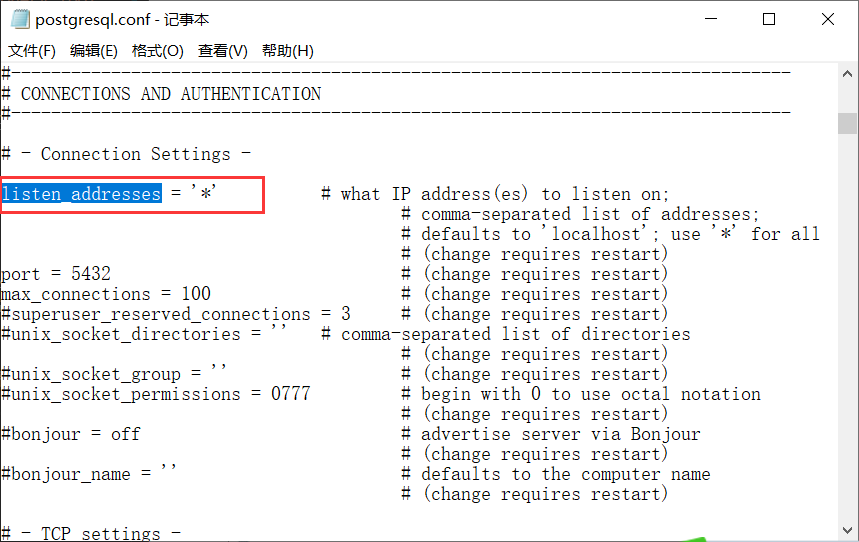

# 数据备份和还原
## PGSQL数据库
#### 备份
* 打开pgAdmin，在弹出的网页上登录；
* 右击待备份的数据库，在弹出的菜单上点击`Backup`；
    
* 在备份会话框内输入信息
    
    * Filename 输入完整路径和备件文件名，可通过右侧按钮选择路径；
    * Encoding 编码格式，请选择`UTF-8`；
* 点击按钮`Backup`开始备份，右下角弹出备份进度信息框。
    
#### 还原
* 右击需要还原的目标数据库，在弹出的菜单上点击`Restore`；
    
* 在还原会话框内输入信息
    
    * Filename 输入已备份好的文件路径和名称，可通过右侧按钮选择（注意文件格式"Format"的筛选）；
    * Role name 角色名，请选择`postgres`；
* 点击按钮`Resore`开始还原，右下角弹出还原进度信息框。
#### 查询
*  选中数据库（或数据库下的节点），点击`Tools`菜单，点击`Query Tool`
    
*  在新增的面板中输入查询语句，点击执行（闪电形状的按钮），下方将显示查询结果
    
    * PGsql的语法与SQL server有些不同，参考<http://www.postgres.cn/docs/10/sql.html>
#### 远程访问设置
配置文件位于安装目录`C:\Program Files\PostgreSQL\12\data`下，**pg_hba.conf**和**postgresql.conf**
* **pg_hba.conf**，配置数据库的访问权限
    在图示位置增加允许访问的IP: `host    all             all             10.1.1.0/24            md5`，其中`24`是子网掩码，表示允许IP地址在`10.1.1.0`~`10.1.1.255`内的计算机访问。
    
* **postgresql.conf**，配置数据库的访问权限
    在文件中确认`listen_addresses = '*'`，并且未被`#`注释。
    