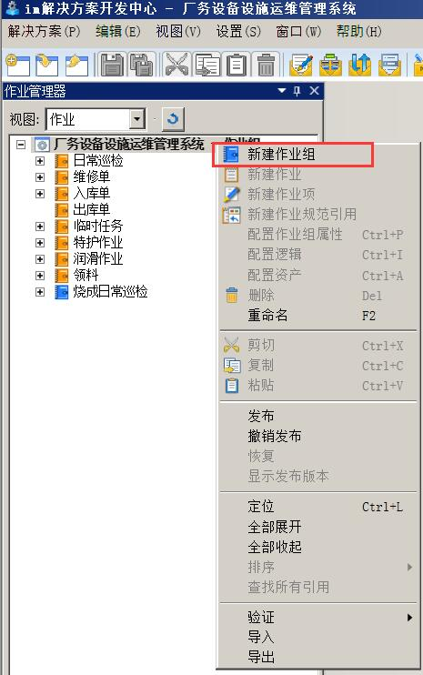
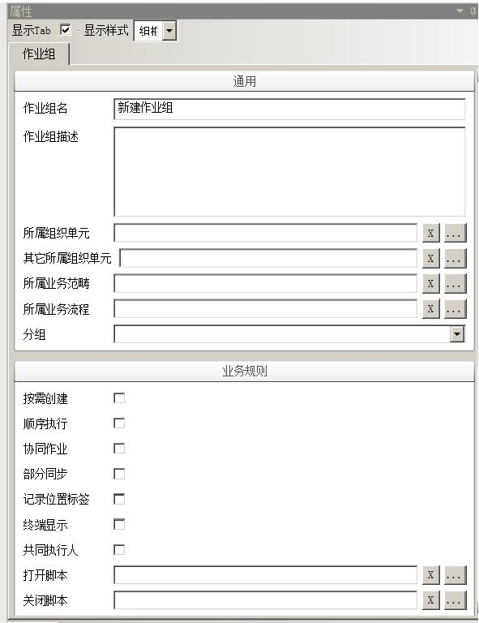
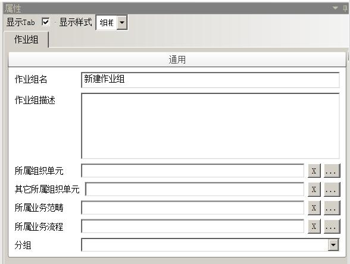
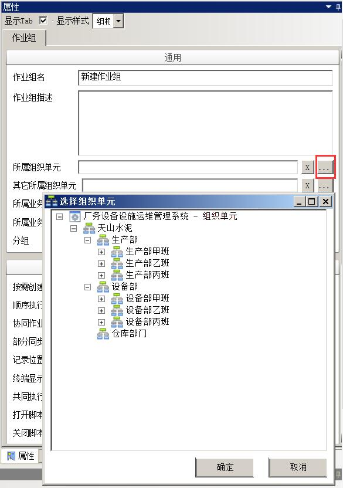
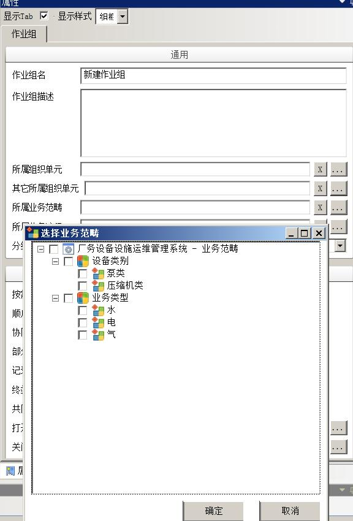
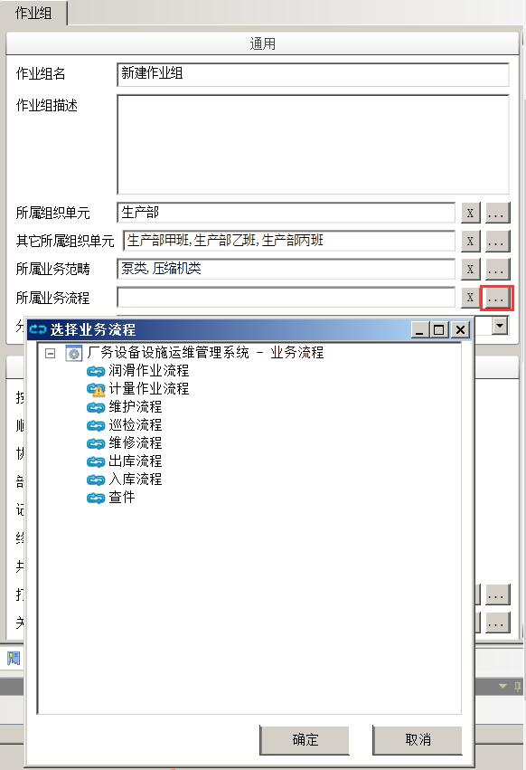
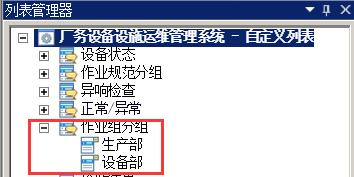
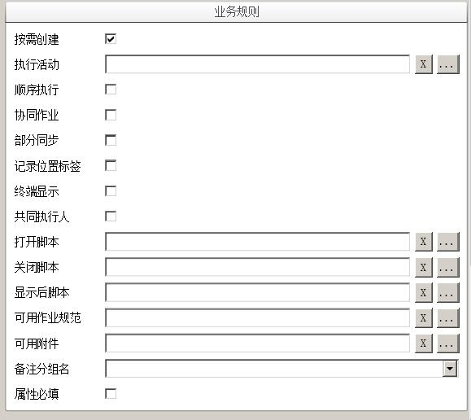
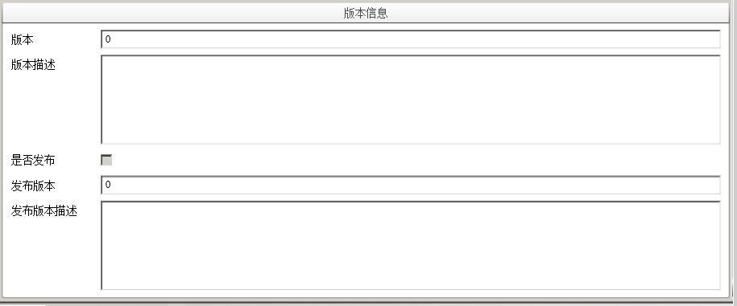

# 作业组

## 新建作业组

* 在作业管理器中的作业规范管理选项卡内空白地方，选中解决方案名，点击鼠标右键，选择**新建作业组**，创建一个作业组。

  

* 同时，属性栏出现该作业组的属性对话框。

  

## 配置作业组通用属性

作业组通用属性除名称和描述外，主要应配置其所属组织单元，业务范畴和业务流程。其中，所属组织单元和业务流程是必须配置的，所属业务范畴并非一定要配置。如图：

* 更改新建的作业组名称，或者在属性栏**作业组名**框中输入作业组名称。

* 在属性栏**作业组描述**框中输入新建作业组的说明文字，如作业组涵盖哪些作业活动。

* 在作业组属性栏**所属组织单元**框中，单击
	
按钮以显示选择组织单元对话框（单击
	
按钮可清空所选组织单元），在对话框内组织单元树（对话框内显示的组织单元为**im 解决方案开发中心**->**组织架构管理器**->**组织单元**内配置）选择新建作业组所属的组织单元，即该作业组代表的现场作业活动集合分属哪个部门，单击**确定**完成。

  	

* 在作业组属性栏**其它所属组织单元**框中，单击
	
按钮以显示选择组织单元对话框（单击
	
按钮可清空所选组织单元），在对话框内组织单元树可以选择新建作业组所属的一个或者多个组织单元，即该作业组代表的现场作业活动集合还分属哪个部门，单击**确定**完成。

* 在作业组属性栏**所属业务范畴**框中，单击
	
按钮以显示选择业务范畴对话框（单击
	
按钮可清空所选业务范畴），在对话框内业务范畴列表可以选择新建作业组所属的一个或者多个业务范畴，即该作业组代表的现场作业活动集合还分属何种业务范畴，单击**确定**完成。

  

* 在作业组属性栏**所属业务流程**框中，单击
	
按钮以显示选择业务流程对话框（单击
	
按钮可清空所选业务流程），在对话框内业务流程列表中可以选择新建作业组所属的业务流程，即该作业组代表的现场作业活动集合分属哪个业务流程进行运转，单击**确定**完成。

  

* **分组** - 可以给作业规范选择一个分组名，方便管理。作业组的分组需要先在**列表管理器** - **自定义列表**中建立分组名，分组才能选择

  

## 配置作业组业务规则

配置作业组业务规则，如图：

* **按需创建** - 按需创建的作业组允许执行活动的参与者直接在手持终端上创建并完成。

* **执行活动** - 指定作业组中按需创建时活动，默认为空，表示所属业务流程中所有执行活动

* **顺序执行** - 顺序执行的作业组要求其下的第一层节点（包括作业或者作业项）必须按照顺序来完成。

* **协同作业** - 协同作业的作业组要求流程中每个执行活动必须按照顺序来完成，即使某个角色或者人员同时拥有流程中先后两个执行活动的权限，也必须先完成前面一个执行活动，并同步上传后，再同步下载到终端执行后一个执行活动。

* **部分同步** - 部分同步的作业组允许手持终端在没有完成作业组的情况下，将部分已经完成的作业或作业项结果同步回 im 企业运营中心。

* **记录位置标签** - 启用 GPS 记录打开作业组的所在位置的经纬度信息。

* **终端显示** - 在终端**创建**页面显示该作业组，必须是支持**按需创建**的作业组。

* **共同执行人** - 在作业组标记为完成后，弹出用户列表，用于选择共同执行作业组的人员。

* **打开脚本** - 在作业组打开的时候执行的脚本。

* **关闭脚本** - 在作业组关闭的时候执行的脚本。

* **显示后脚本** - 在作业组打开显示的时候执行的脚本。

* **可用作业规范** - 选择该作业组在手持终端上可以按需添加或创建的作业规范。

* **可用附件** - 可选择文档、图片等附件以在手持终端上执行该作业时查看，指导作业操作。

* **备注分组名** - 完成作业组时如果有未完成作业项要求填写的作业组属性分组。

* **属性必填** - 指定的作业组属性分组下所有属性是否必填。

## 作业组版本信息

作业组版本信息，如图：

* **版本** - 只读信息。目前正在编辑的作业组版本号，由系统自动维护，每一次发布时此编辑版本将自动增加。

* **版本描述** - 用户可输入对作业组该版本的说明文字。如何时何人创建、修改，因何修改等。

* **是否发布** - 只读信息。当该作业组有发布的版本时，系统将自动地勾选。

* **发布版本** - 只读信息。当前作业组发布时的编辑版本显示。

* **发布版本描述** - 只读信息。发布版本对应的版本描述。
