# 作业规范

## 新建作业规范

* 在作业管理器中的作业规范管理选项卡内空白地方，选中解决方案名，点击鼠标右键，选择**新建作业组规范**，创建一个作业规范。

  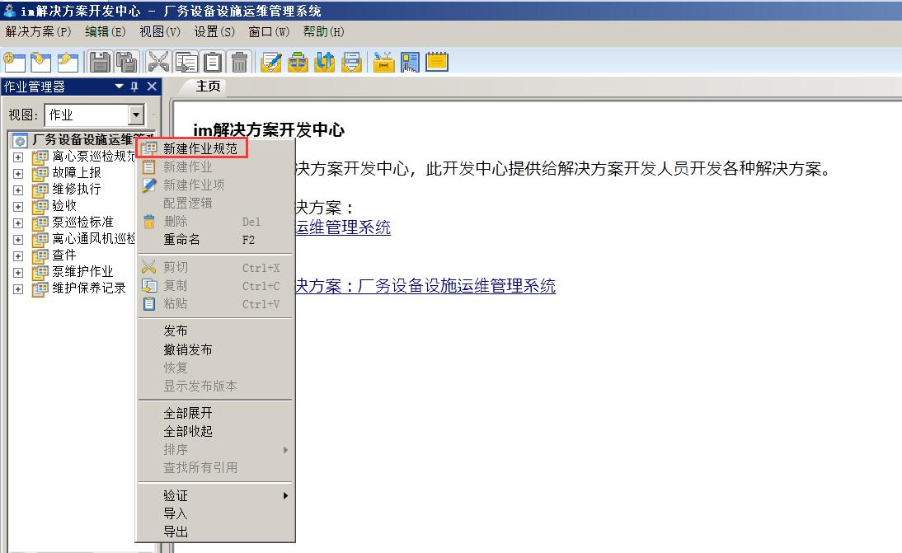

* 同时，属性栏出现该作业组的属性对话框。

  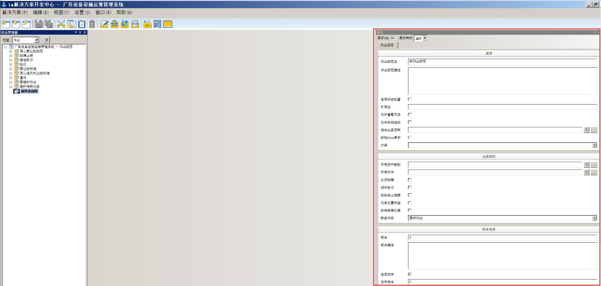

## 配置作业规范通用属性

配置作业规范通用属性，如图：

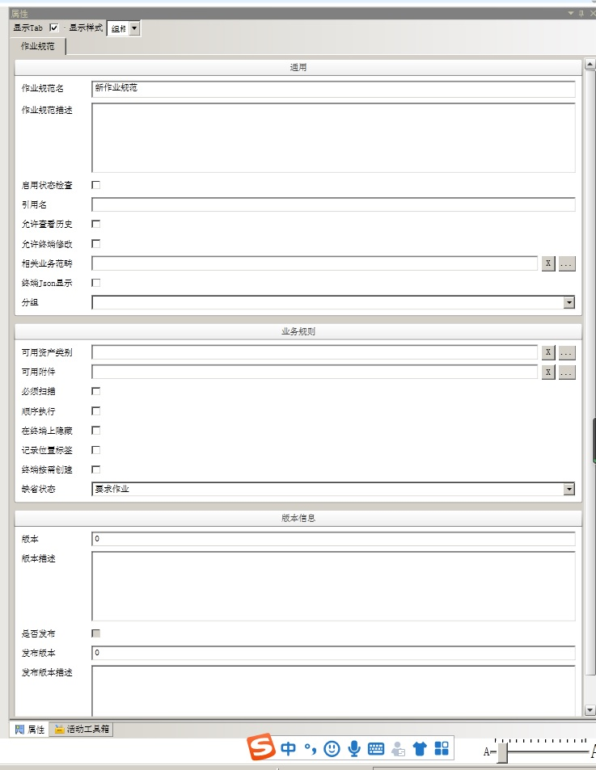

* 更改新建的作业规范名称，或者在属性栏**作业规范名**框中输入作业规范名称。

* 在属性栏**作业规范描述**框中输入新建作业规范的说明文字，如作业规范涵盖哪些作业活动。

* **启用状态检查** - 是否该作业启用状态检查。状态是针对作业的特殊变量，它是一个列表类型的数据，可以由手持终端的执行者根据现场情况进行录入，录入的数据可以影响作业的执性。最典型的场景比如该作业活动因为某些客观原因影响执行，如关联的设备停电或者无法进入作业现场等，用户在手持终端上录入状态，并根据作业配置的逻辑决定是否执行作业。用户可以决定是否针对该作业启用状态检查。若启用状态检查，应配置一列表数据供手持终端操作时选择，如下图。

  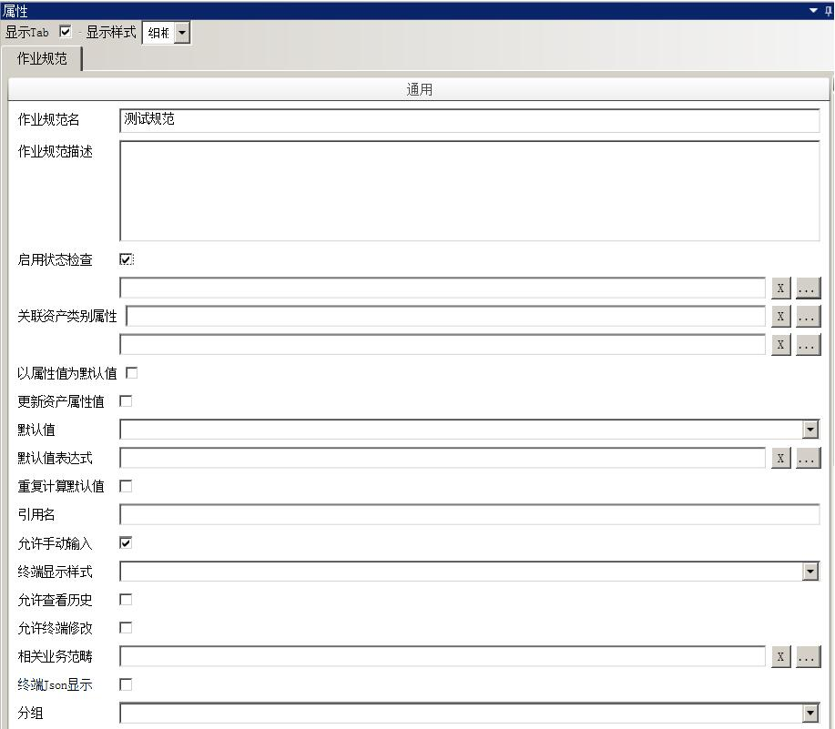

  * 启用设备状态，选择需要的列表

    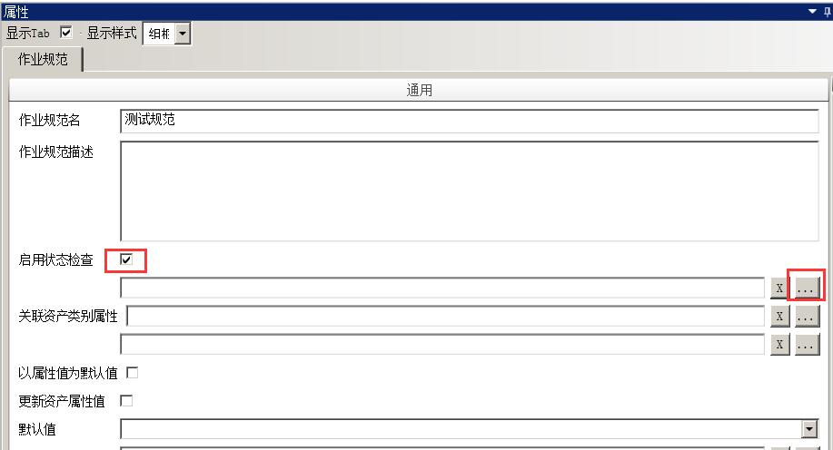

    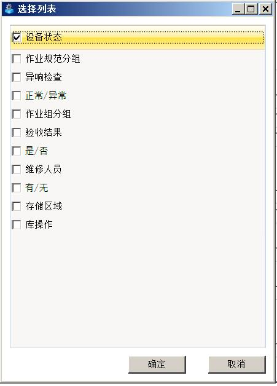
  
  * 选择相应的列表后会出现**列表约束**，在**列表管理器**中选择解决方案根节点右击， 选择**配置关联关系**

    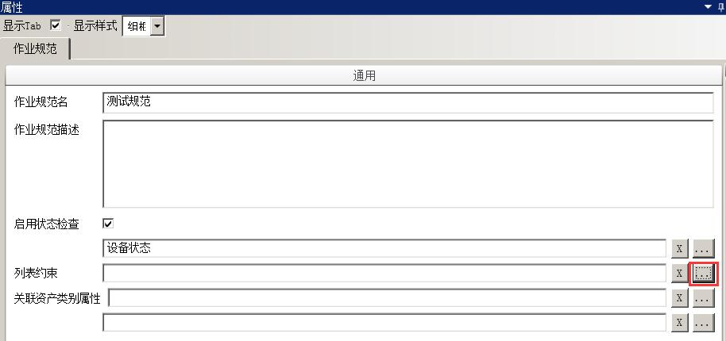

    * **配置关联关系**

      * 在**列表管理器**中选择解决方案根节点右击， 选择**配置关联关系**

        

      * 在配置关联关系配置界面，输入当前配置的关联关系名称。如有已配置好的关联关系则可以在已配置的关联关系中选择，如第一次配置则为缺省。单击**添加关系**，新增一个关联关系。

        

      * 根据实际情况需要，添加关系，完成关联关系配置

        

      * 单击**保存**完成。配置完成后，在作业通用属性中添加**列表约束**。•**确定**后完成配置。

        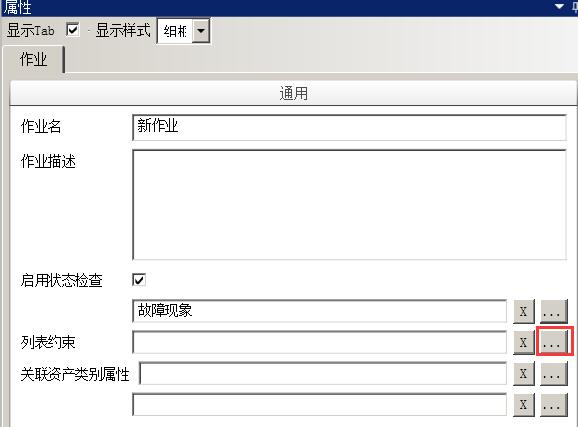

        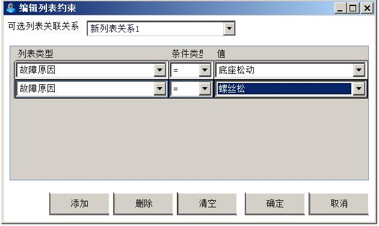

* **关联资产类别属性** - **启用状态检查**配置完成后，可选择一个对应的资产类别属性（关联资产类别内配置）

* **以属性值为默认值** - 以关联的资产类别属性值为该作业规范的默认值。

* **更新资产属性值** - 以作业规范值更新关联的资产类别属性值。

* **默认值** - 该值将在用户使用手持终端执行该作业时出现在值输入框中。可根据需要选择是否使用默认值，不适用则不添加。

* **默认值表达式** - 通过编辑JavaScript脚本表达式的方式计算出默认值，该值将在用户使用手持终端执行该作业时出现在值输入框中。可根据需要选择是否使用默认值表达式，不适用则不添加。

  

* **重复计算默认值** - 用户使用手持终端执行过一次该作业后，当有相关值发生修改，如果需要重新计算该值时，则可根据需要选择是否使用重复计算默认值，不适用则不勾选。

* **引用名** - 该作业规范的别名。当该作业规范内其它的作业项逻辑或者作业逻辑的标签变量需要使用该作业规范状态值时，或作为跳转、创建逻辑行为的目标时，使用该引用名。

* **允许手动输入** - 是否允许在手持终端手动输入作业值。

* **终端显示样式** - 选择输入值在终端的显示及输入方式

  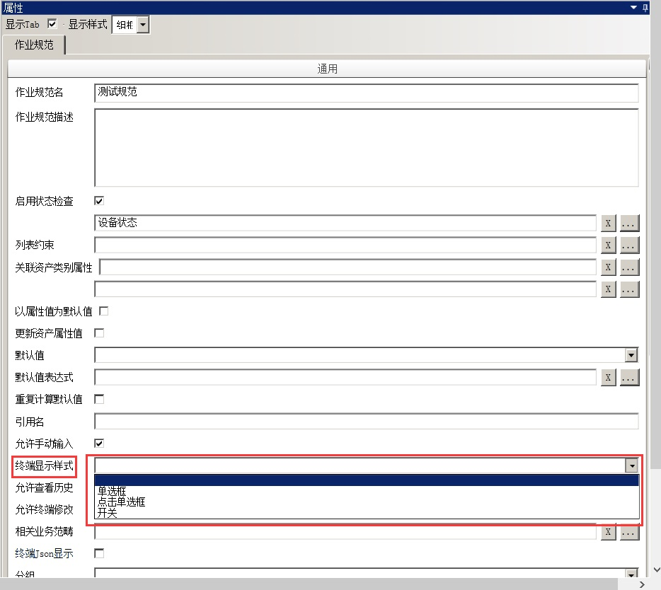

* **允许查看历史** - 若选择，手持终端将能够查看该作业规范的历史数据。

* **允许终端修改** - 是否允许手持终端对作业规范进行改名、重新关联资产、删除等编辑操作。

* **终端Json显示** - 作业规范以Json的方式在终端呈现

  * **是否为数组** - 作业规范选择**终端Json显示**后，可以选择是否为Json数组
    * **数组长度** - 作业规范选择**终端Json显示**并且为数组后，可以对Json数组的长度进行设置，长度默认为“0”，则表示不限制长度。

  

* **分组** - 可以给作业规范选择一个分组名，方便管理。作业规范的分组需要先在**列表管理器** - **自定义列表**中建立分组名，分组才能选择

  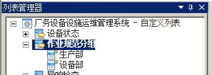

## 配置作业规范业务规则

配置作业规范业务规则，如图：

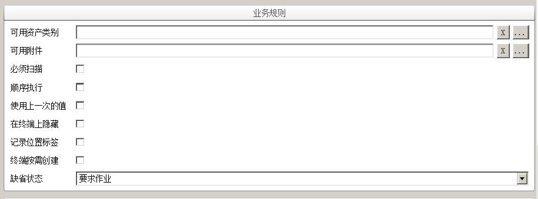

* **可用资产类别** - 配置在作业规范可应用的资产范围

* **可用附件** - 可选择文档、图片等附件以在手持终端上执行该作业时查看，指导作业操作。

* **必须扫描** - 该作业规范在执行时必须扫描，才能对其以及其下所有子作业和作业项进行操作。该项业务规则将影响到其在手持终端上的执行。如果没有扫描，该作业下的所有子作业和作业项均是无效的。只有关联了资产并且该关联资产是扫描点，这个配置才是有效的。

  * **扫描方式** - 该作业规范选择为**必须扫描**时，可以对其扫描方式进行设置，如："任意"、"条码"、"RFID"、"无感"，默认为"任意"。

    

* **顺序执行** - 该作业下的子作业或者作业项要求按照配置的顺序进行执行。在手持终端上， 如果前面的作业未执行，后面的作业或者作业项将是无效的，无法执行。

* **使用上一次的值**- 为方便手持终端用户操作，将该作业规范上一次的值将作为缺省值输入到手持终端。

* **在终端上隐藏** - 该作业规范在手持终端作业执行页面不可见，在终端导航页面可见。

  * **子节点在视图上为本层** - 该作业规范子节点上的内容在终端页面上为同层显示。

  

* **记录位置标签** - 记录该作业所属位置信息

* **终端按需创建** - 允许该作业规范在手持终端按需添加到作业组内执行。

* **缺省状态** - 系统针对作业有三个状态（该状态不是 **启用状态检查** 中用户自定义的状态，而是启用状态检查的结果）：要求作业，不要求作业，禁止作业。这三个状态可以根据作业逻辑动态变化。

  * **要求作业** - 要求手持终端完成其下的每一个子作业和作业项，如果未完成，绩效统计时将影响完成率计算；

  * **不要求作业** - 不要求的子作业或者作业项，但现场作业人员允许自行根据现场情况进行判断，决定其是否完成。完成的不要求作业项在绩效统计和评估时均作为额外完成作业项处理；

  * **禁止作业** - 在手持终端上无法进行这些作业。

  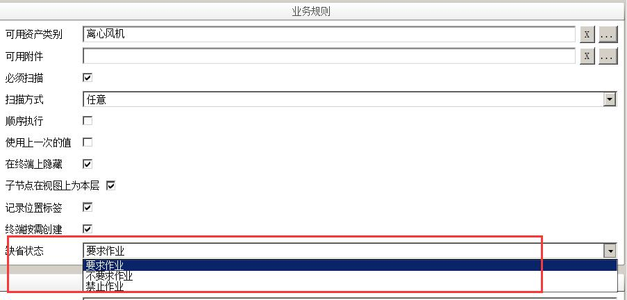

## 作业规范版本信息

作业规范版本信息，如图：

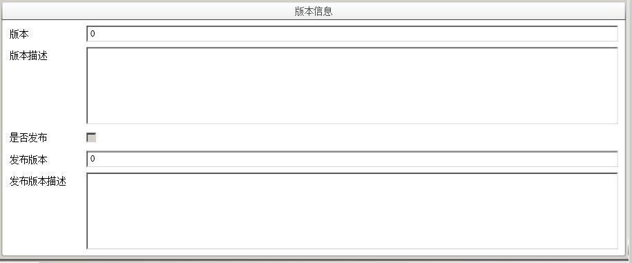

* **版本** - 只读信息。目前正在编辑的作业组版本号，由系统自动维护，每一次发布时此编辑版本将自动增加。

* **版本描述** - 用户可输入对作业组该版本的说明文字。如何时何人创建、修改，因何修改等。

* **是否发布** - 只读信息。当该作业组有发布的版本时，系统将自动地勾选。

* **发布版本** - 只读信息。当前作业组发布时的编辑版本显示。

* **发布版本描述** - 只读信息。发布版本对应的版本描述。
