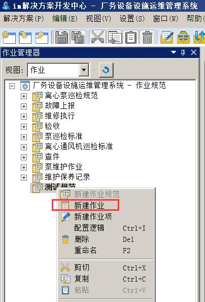
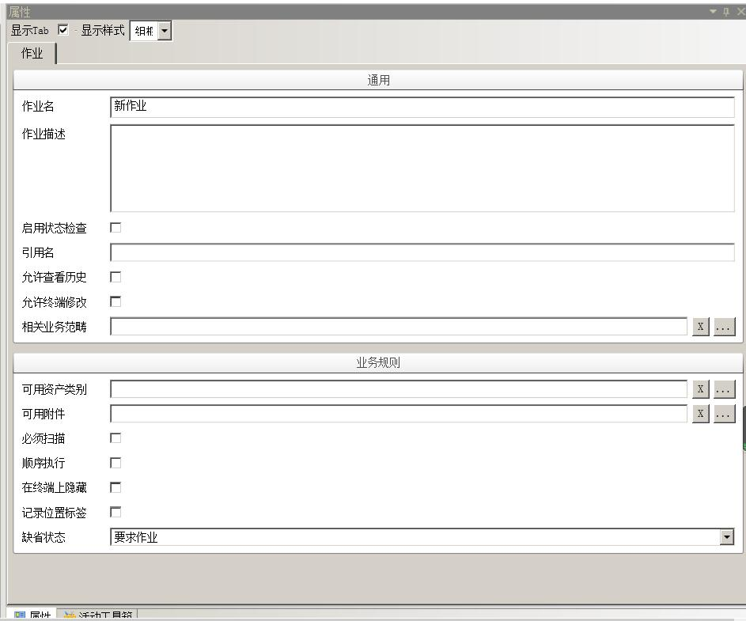
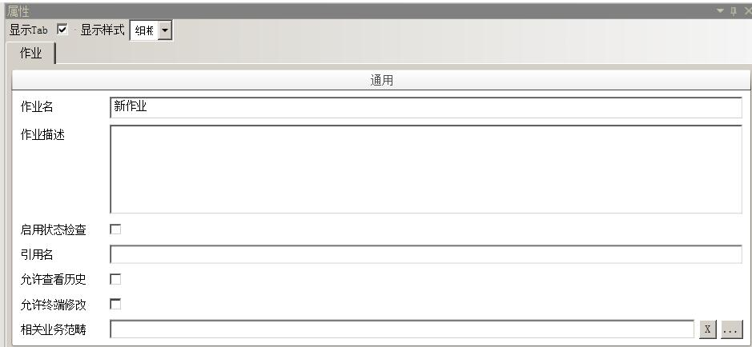
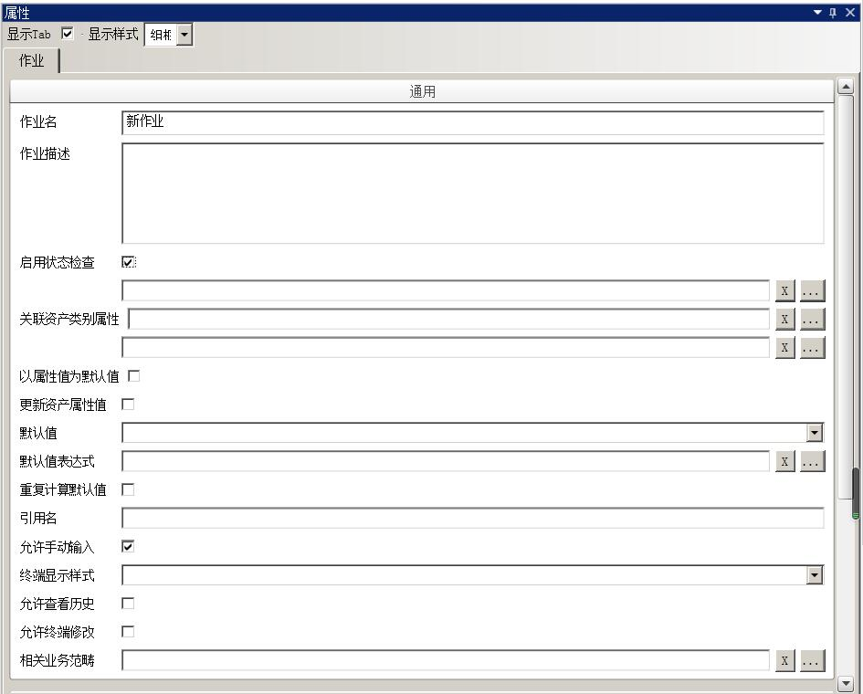
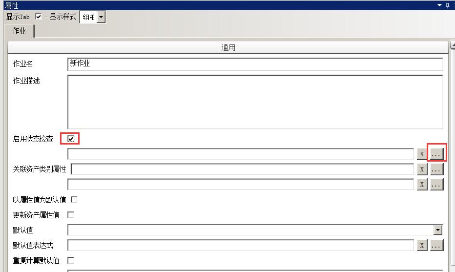
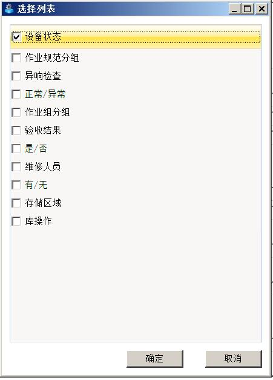
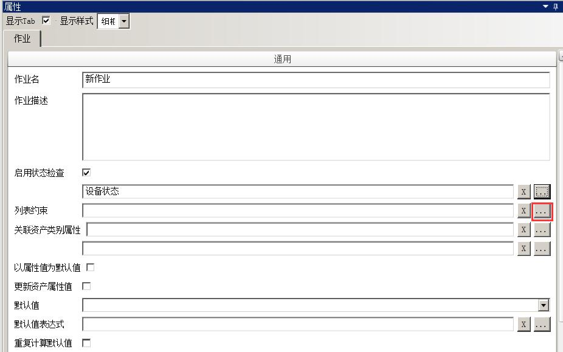
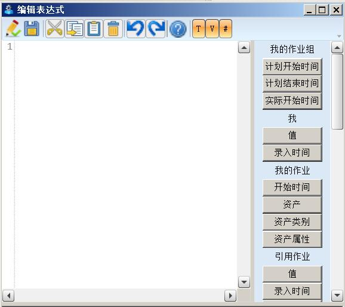

# 作业规范下作业

作业是作业规范的子结点，它代表了针对某个资产（设备或区域）的现场作业内容。作业可以嵌套作业，也就是说，作业允许有其子作业。作业的执行可以由一系列业务规则来控制。配置好的作业将在手持终端上执行。

## 配置作业

* 在 im **解决方案开发中心**->**作业管理器**内，选中作业作业规范，右键选择**新建作业**，创建一个作业。

* 同时，属性栏出现该作业的属性对话框。

## 配置作业通用属性

配置作业通用属性，如图：

* **作业名** - 作业名称，用于用户对该作业的识别，同一个层次的作业名称是唯一的，不同层次的作业名称可同名。

* **作业描述** - 对该作业的描述信息。

* **启用状态检查** - 是否该作业启用状态检查。状态是针对作业的特殊变量，它是一个列表类型的数据，可以由手持终端的执行者根据现场情况进行录入，录入的数据可以影响作业的执性。最典型的场景比如该作业活动因为某些客观原因影响执行，如关联的设备停电或者无法进入作业现场等，用户在手持终端上录入状态，并根据作业配置的逻辑决定是否执行作业。用户可以决定是否针对该作业启用状态检查。若启用状态检查，应配置一列表数据供手持终端操作时选择，如下图。

  * 启用设备状态，选择需要的列表

  * 选择相应的列表后会出现**列表约束**，在**列表管理器**中选择解决方案根节点右击， 选择**配置关联关系**

* **关联资产类别属性** - 可选择一个对应的资产类别属性（关联资产类别内配置）

* **以属性值为默认值** - 以关联的资产类别属性值为该作业规范的默认值。

* **更新资产属性值** - 以作业规范值更新关联的资产类别属性值。

* **默认值** - 该值将在用户使用手持终端执行该作业时出现在值输入框中。可根据需要选择是否使用默认值，不适用则不添加。

* **默认值表达式** - 通过编辑JavaScript脚本表达式的方式计算出默认值，该值将在用户使用手持终端执行该作业时出现在值输入框中。可根据需要选择是否使用默认值表达式，不适用则不添加。

* **重复计算默认值** - 用户使用手持终端执行过一次该作业后，当有相关值发生修改，如果需要重新计算该值时，则可根据需要选择是否使用重复计算默认值，不适用则不勾选。

* **引用名** - 该作业的别名。当其它的作业项逻辑或者作业逻辑的标签变量需要使用该作业状态值时，或作为跳转逻辑行为的目标时，使用该引用名。

* **允许查看历史** - 是否允许手持终端查看该作业状态的历史数据，仅在启用状态检查时有效。

* **允许终端修改** - 是否允许手持终端对作业进行改名、删除等编辑操作。

* **相关业务范畴** - 选择该作业所属业务范畴，可多选。

