# 项目模版

## 新建项目模版

新建项目模版操作如下：

* 打开im解决方案开发中心作业管理器，切换到项目模版，然后选中解决方案名，右键选择新建；

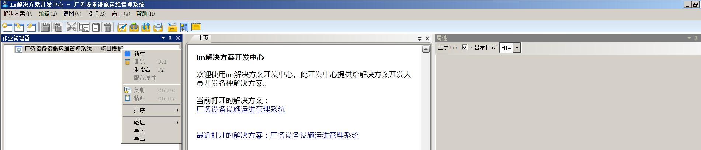

* 填写项目模版名、项目模版描述；

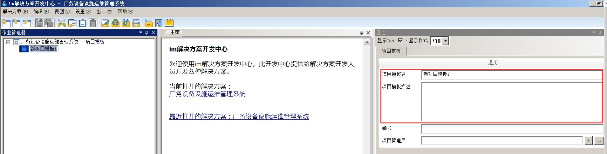

* 填写项目编号，用于设置编码规则；

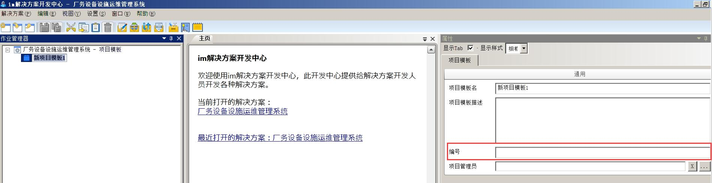

* 设置项目管理员，用于设置能够管理此类项目模板的项目人员，如果没有设置，所有人员可以管理；

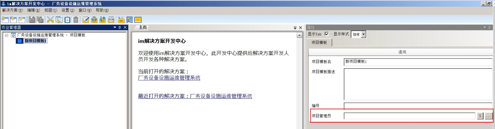
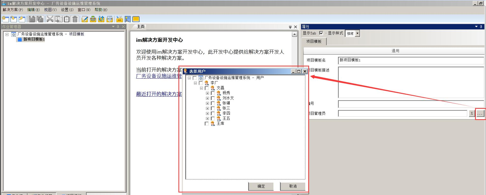

## 删除项目模版

删除项目模版操作如下：

* 打开im解决方案开发中心作业管理器，切换到项目模版，然后选中需要删除的项目模版，右键选择删除；

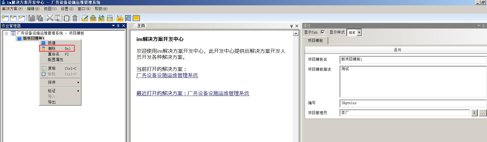

* 弹出窗口点击确认；

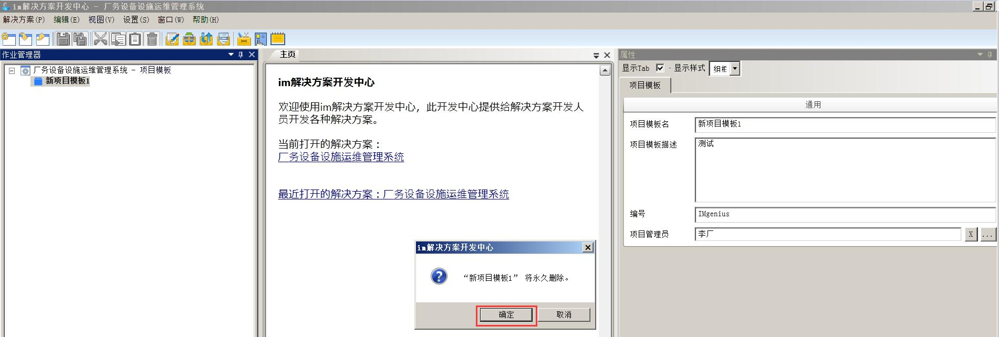

## 重命名项目模版

重命名项目模版操作如下：

* 打开im解决方案开发中心作业管理器，切换到项目模版，然后选中需要重命名的项目模板，右键选择重命名；

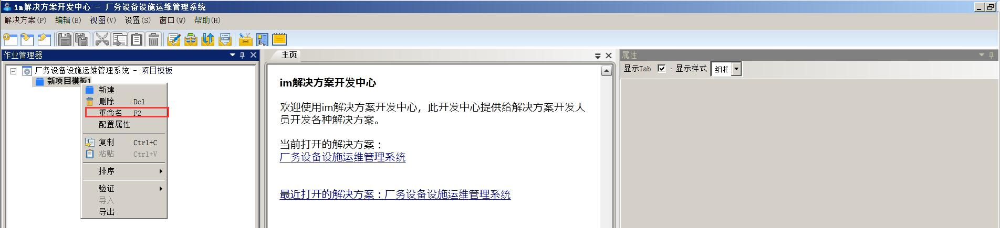

* 输入新的项目模板名字；

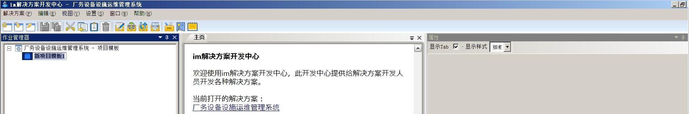

* 也可以直接选择项目模板，在右侧属性框内项目模板名内直接输入新的项目模板名字；

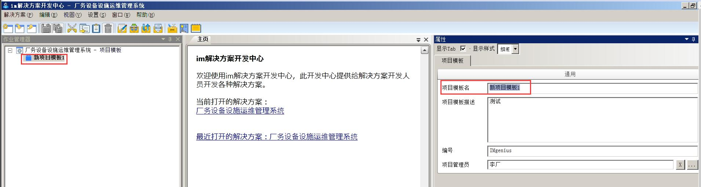

## 配置项目模版属性

配置项目模版属性操作如下：

* 打开im解决方案开发中心作业管理器，切换到项目模版，然后选中需要配置属性的项目模板，右键选择配置属性；

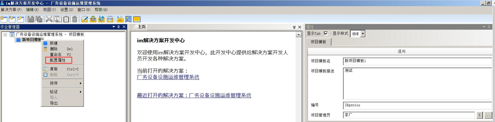

* 如需新增属性，完善属性名、数据类型、缺省值、工程单位、终端同步、不可查看、组名等信息，完成后点击保存。

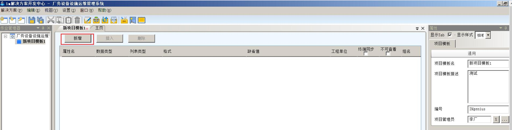
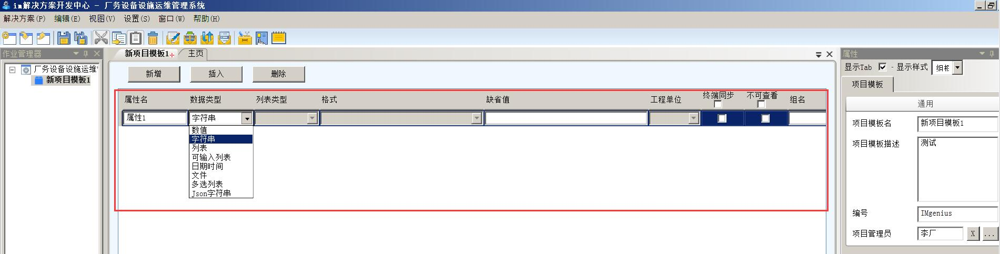

* 如需插入属性，选中需要插入的位置，点击插入，完善属性名、数据类型、缺省值、工程单位、终端同步、不可查看、组名等信息，完成后点击保存。

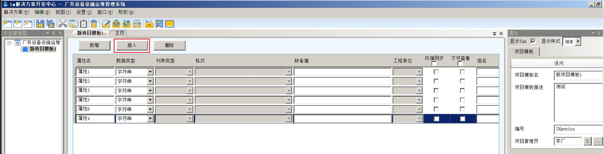

* 如需删除属性，选中需要删除的属性名，点击删除，完成后点击保存。

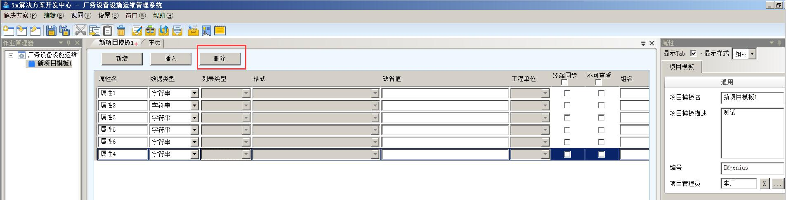

## 复制项目模版

复制项目模版操作如下：

* 打开im解决方案开发中心作业管理器，切换到项目模版，然后选中需要复制的项目模版，右键选择复制；

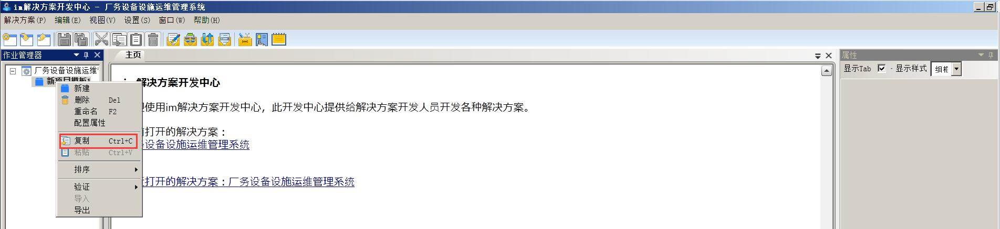

* 选中解决方案名，右键选择粘贴，复制出来的项目模板描述、编号、项目管理员、属性跟原项目模板保持一致。

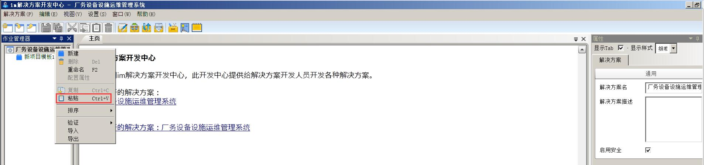
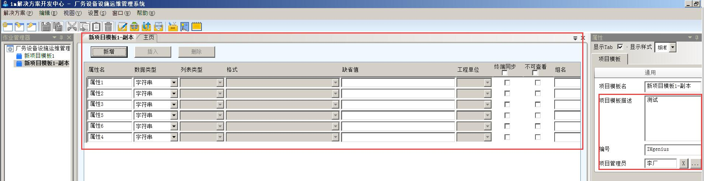

