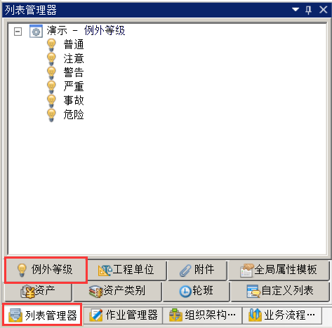
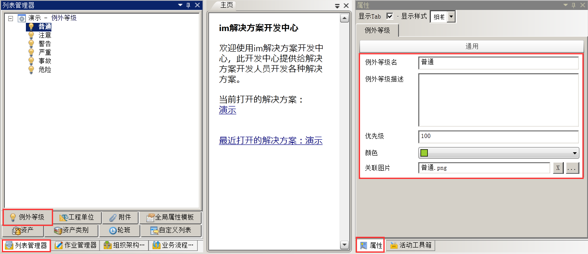
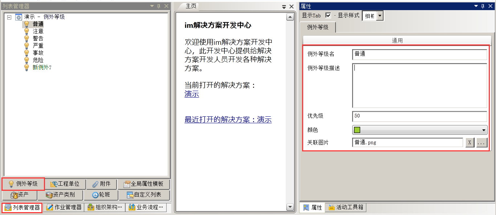
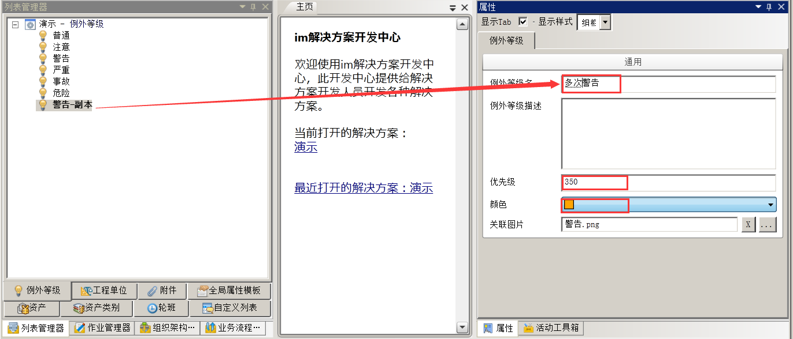

# 例外等级
在imgenius企业移动现场作业管理软件中，使用**列表管理器**的**例外等级**选项卡来预设**例外等级**列表。

系统预设了如下图的**例外等级**：

  

* 普通，**例外等级**100，图标 ，颜色  
* 注意，**例外等级**200，图标 ，颜色  
* 警告，**例外等级**300，图标 ，颜色  
* 严重，**例外等级**400，图标 ，颜色  
* 事故，**例外等级**500，图标 ，颜色  
* 危险，**例外等级**600，图标 ，颜色  

每个例外等级的属性，可进行优先级，颜色，图片的自定义，如图：

一个**例外等级**的优先级别的取值范围为1到9999，数值越大等级越高。

注意：**例外等级**列表数据将用于在**作业管理器**配置**作业项**逻辑，作为关联**例外等级**的备选项。

## 修改和添加例外等级
* 将“普通”例外等级的优先级从100改为50，选中“普通”**例外等级**，如图：

* 添加“多次警告”**例外等级**，优先级为350，颜色为橙色，关联图片同“警告”所关联的图片。
右键“警告”**例外等级**，在弹出快捷菜单中选择复制
右键我的应用—**例外等级**，在弹出的快捷菜单中选择粘贴
选中“警告-副本”**例外等级**，在属性对话框中做如下修改：

选中“多次警告”，按住**Ctrl + ↑3**次，将“多次警告”的顺序调整至“警告”和“严重”之间，如图：

