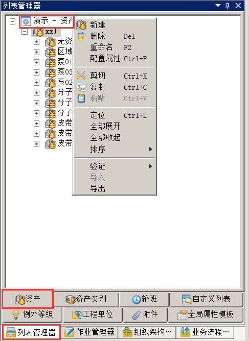
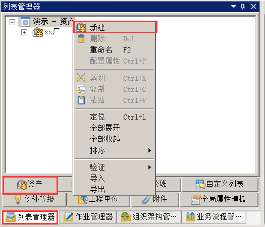

# 资产
在imgenius企业移动现场作业管理软件中，使用**列表管理器**的**资产**选项卡来管理生产活动中的相关设备或者逻辑设备。资产可以包含**资产**，这些**资产**数据在**资产**选项卡内以树状视图的形式存在。

**资产**可以配置自定义的属性称为**资产属性**。**资产**所属**资产类别**的属性将自动添加到**资产属性**中。

可以通过所属**组织单元**选项卡查看管理此**资产**的**组织单元**。
## 配置资产
在**导航栏→列表管理器→资产**内右键**演示-资产**，在快捷菜单中即可完成**资产**的新建、删除、重命名、配置属性、剪切、复制、粘贴、全部展开、全部收起、排序、验证、导入和导出操作。

## 新建资产
在导航栏→列表管理器→资产内选择我的应用-资产，右击，在快捷菜单中选择新建。

选中新资产，在右边属性栏编辑各属性。
资产右边属性框配置示例，如图：

