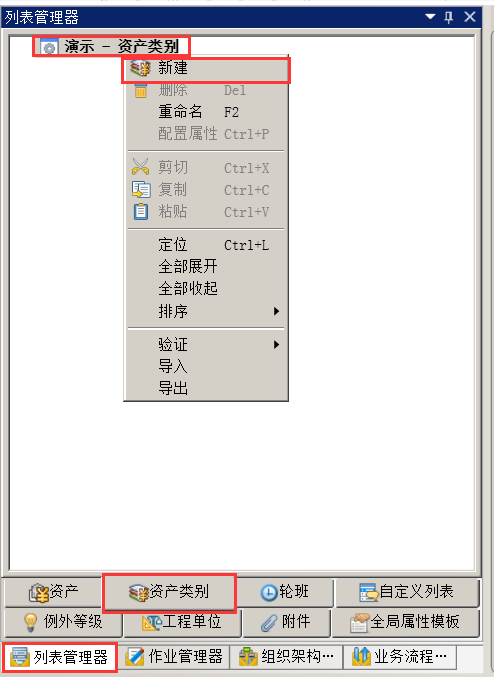
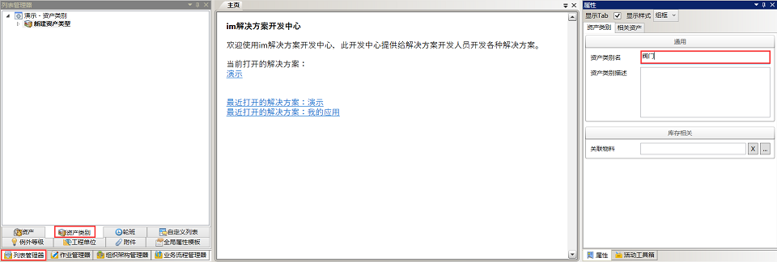
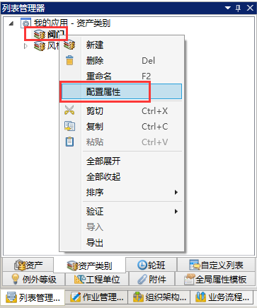
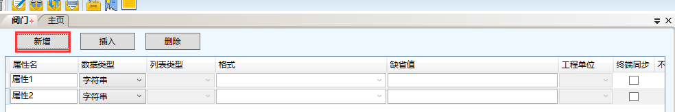
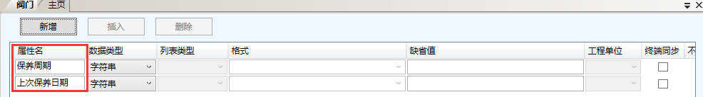
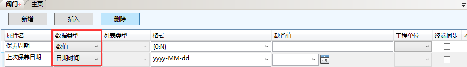
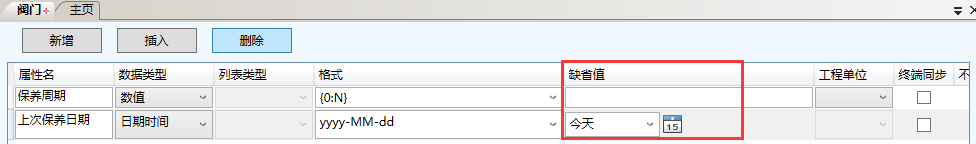
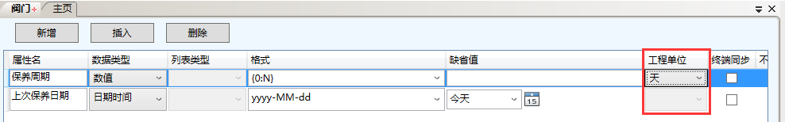
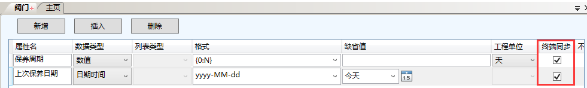

# 资产类别
在imgenius企业移动现场作业管理软件中，将有相同现场作业要求的资产归为一个**资产类别**。在imgenius中**资产类别**不能包含**资产类别**。属于同一个类别的**资产**称为此**资产类别**的相关资产。

**资产类别**可以配置自定义的属性称为**资产类别**属性。**资产类别**的属性将自动添加到相关**资产**的属性中。
## 配置资产类别
在**导航栏→列表管理器→资产类别**内右键演示-**资产类别**，在快捷菜单中即可完成资产类别的新建、删除、重命名、配置属性、复制、粘贴、排序、验证、导入和导出操作。
## 新建资产类别
在**导航栏→列表管理器→资产类别**内选择演示-**资产类别**，右击，在快捷菜单选择新建，如图：

选中新资产类别1，在右边属性栏中：
* 更改新建的资产类别名（例如：阀门）。
* 在资产类别描述框中输入相关的说明文字（例如：空）。 
* 在资产类别属性栏相关资产中可以查看属于此资产类别的资产。
示例如图：

## 配置资产类别属性
选中一个**资产类别**（例如“阀门”）右击，在快捷菜单中选择配置属性，如图：

连续单击2次新增，添加2个资产属性，如图：

按照下图依次修改属性名，如图：

按照下图依次修改数据类型，如图：

按照下图修改缺省值，如图：

按照下图修改工程单位，如图：

终端同步全部勾选，如图：

