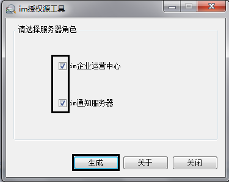
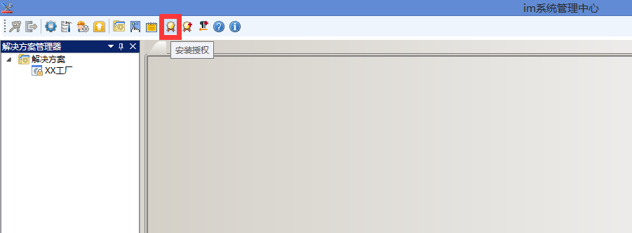
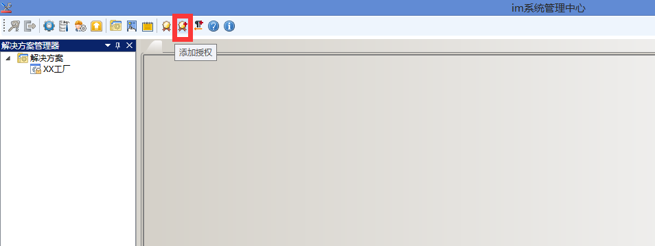
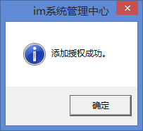
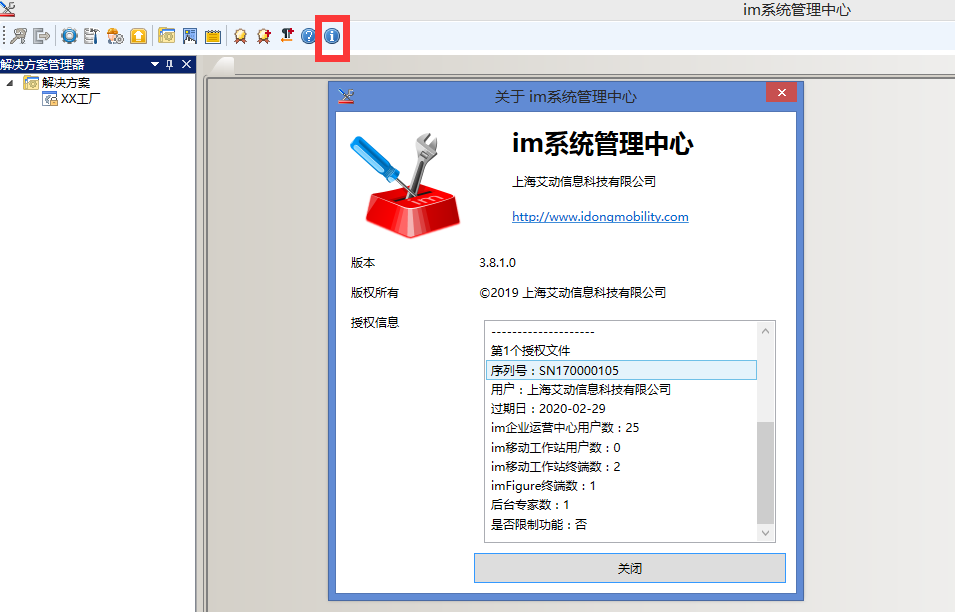

# 生成授权源文件  
使用授权源工具，用户在需要部署的计算机节点上获取相应的节点信息，并生成信息文件。该文件需提供给上海艾动信息科技有限公司，以生成能够运行在该计算机节点上的授权文件。  
在开始菜单→程序→iDong→imgenius企业移动现场作业管理软件→通用工具下，双击授权源工具。

在指定的文件夹将生成imlic.info的文件。将此文件寄给上海艾动信息科技有限公司或其分销商，注册并获得授权文件。点击关闭退出该应用。
# 安装授权  
在开始菜单→程序→iDong→imgenius企业移动现场作业管理软件下，右键管理员方式打开im系统管理中心。将系统供应方给的授权文件按下图操作放入：

  
*注意：如果安装失败请联系系统供应方；*
*注意：如安装授权功能会将之前使用的授权全部替代；*
# 添加授权  
在开始菜单→程序→iDong→imgenius企业移动现场作业管理软件下，右键管理员方式打开im系统管理中心。将系统提供方给的授权文件按下图操作放入：

  
*注意：如果安装失败请联系系统供应方；*  
*注意：如果之前已经有一个授权在使用且不想使其失效则使用添加授权功能；*
# 查看授权是否生效  
在开始菜单→程序→iDong→imgenius企业移动现场作业管理软件下，右键管理员方式打开im系统管理中心。点击*关于系统管理中心*
  
