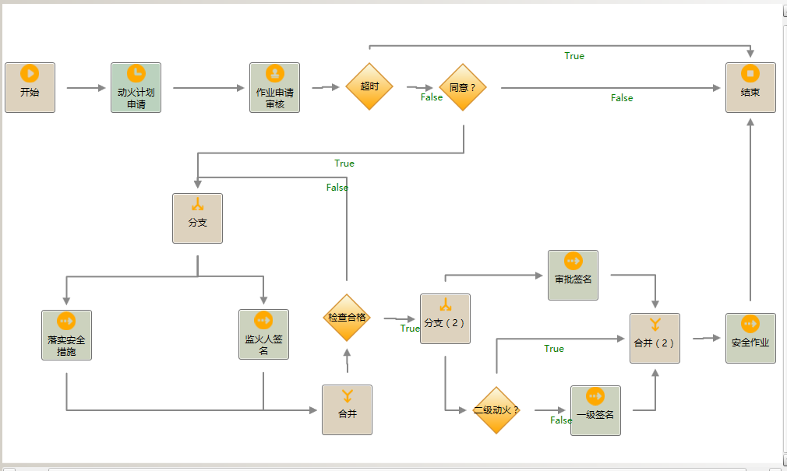

# 概述
实现8大安全作业的定点，定人，定时，违规操作报警。
*注意：需要和钛准定位系统结合使用*
具体功能实现：
* 可绘制的作业范围-围栏。
* 终端定位作业人员，保证人员在指定范围作业。
* 对于需要气体检测的作业，第一次检查不是完全安全范围的，每半小时创建一个检测作业组，中途暂停作业超过1h的，也会创建检测作业组，要求人员去现场检测。
* 对于监护人员离场，无关人员闯入围栏范围，围栏范围人员过多，作业超时都能及时报警。
* 规范安全作业流程，减少作业事故发生，提高企业效益。
# 流程
申请动火->审核->现场落实安全措施，气体检测，监护人到位->领导签名->开始动火->验收结束

*注意：审核签名活动名称不能更改，在这个活动时才会判断是否创建气体检测作业*
