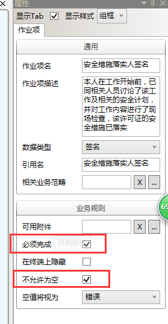
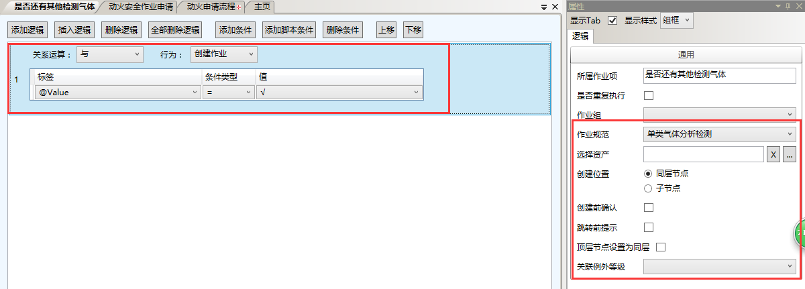
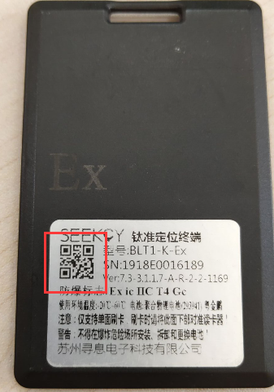
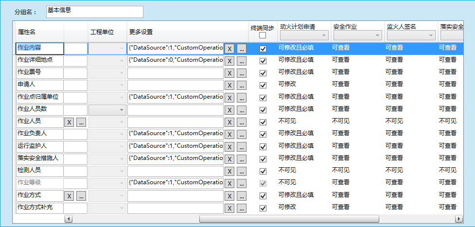
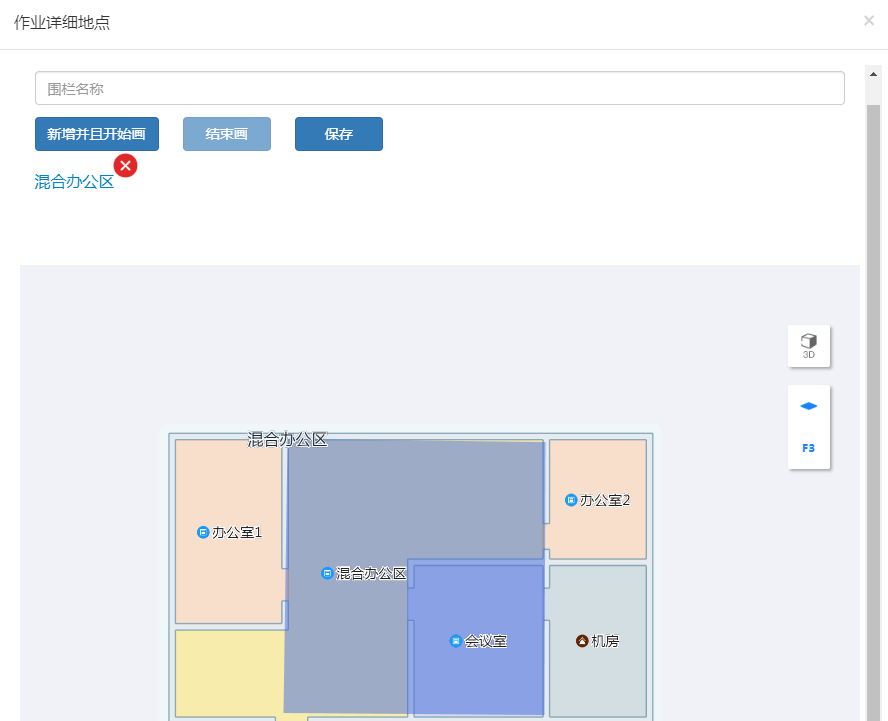
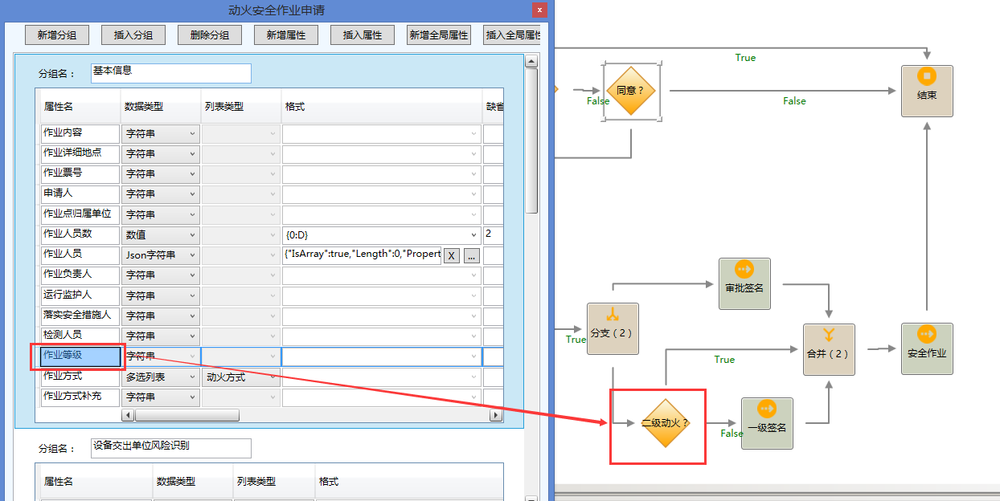

# 概述
实现8大安全作业的定点，定人，定时，违规操作报警。
*注意：需要和钛准定位系统结合使用*
具体功能实现：
* 可绘制的作业范围-围栏。
* 终端定位作业人员，保证人员在指定范围作业。
* 对于需要气体检测的作业，第一次检查不是完全安全范围的，每半小时创建一个检测作业组，中途暂停作业超过1h的，也会创建检测作业组，要求人员去现场检测。
* 对于监护人员离场，无关人员闯入围栏范围，围栏范围人员过多，作业超时都能及时报警。
* 规范安全作业流程，减少作业事故发生，提高企业效益。
# 流程
申请动火->审核->现场落实安全措施，气体检测，监护人到位->领导签名->开始动火->验收结束

其中*动火计划申请*和*作业申请审核*主要是EOC审核，主要是对一些作业组属性进行操作。
*落实安全措施*、*监火人签名*、*审批签名*、*一级签名*、*安全作业*都是分别是安全员，监护员，主管，经理，监护员在*现场*操作。
*注意：审核签名活动名称不能更改，在这个活动时才会判断是否创建气体检测作业*
# 作业
## 落实安全措施
* [详见作业规范-动火安全措施](#dhaqcs)。
* <span id="qm">安全措施落实人签名</span>
这里主要就是确定作业人是到围栏范围内落实安全措施了。所以有个查询此人是否在围栏范围的脚本。
```
var baseUrl = 'http://' + GlobalInfo.GetSyncServer() + ':8011';
var buildId = ScriptEngine.Context.GetTaskGroupPropertyValue('buildId') ;
// 查询人员
var IsInRail = function(_name, _rail, _callback){
	$.ajax({
      url: baseUrl + '/IsInRail?name=' + _name + '&rail=' + _rail,
      type: 'get',
      dataType: 'json',
      timeout: 1500,
      headers: {
        'Content-Type': 'application/json'
      },
      data: JSON.stringify({
      	'buildId':buildId,
		'railName':_rail,
		'name':_name
      }),
      success: function(res){
      	if(res && res.IsOk){
      		_callback(res.Response);
      	}
      	else{
      		Common.ShowDebug(JSON.stringify(res));
      		_callback();
      		return;
      	}
      },
      error: function(XMLHttpRequest, textStatus, errorThrown){
        Common.ShowDebug(errorThrown + XMLHttpRequest.responseText);
        _callback();
        return;
      }
    });
};
var resultName = ScriptEngine.GetResultName();
var user = GlobalInfo.GetLoginUser();
var rail = ScriptEngine.Context.GetTaskGroupPropertyValue('作业详细地点');

IsInRail(user.Name,rail,function(isIn){
	if(isIn){
		ScriptEngine[resultName] = false;
	}
	else {
		alert('登陆人'+ user.Name +'不在围栏内，请到达作业围栏范围内再执行作业。')
		ScriptEngine[resultName] = true;
	}
})
return {'ResultName':resultName};
如果查询登陆人不在范围内返回true。
```
```
var task = ScriptEngine.Context.GetTaskByID(contextID);
ScriptEngine.Context.SetTaskAttributeValue(task.ID,'Value','') ;
ScriptEngine.Context.SetTaskAttributeValue(task.ID,'Status',JobStatus.New) ;
return true;
将作业项状态修改为未完成状态。
```
结合下面作业项配置就可以做到安全员不在规定围栏范围，完成不了此项作业。

## 检测人员检测
* [详见作业规范-气体检测](#qtjc)。
* 检测人员签名
同[安全措施落实人签名](#qm)。
* <span id="zjcjg">总检测结果</span>
将作业*检测人员检测*下所有作业项*检测结果*的值拿出来归类。只要有一次不合格则返回不合格，没有不合格有合格则返回合格，全部为安全才返回安全。
```
var context = ScriptEngine.Context;
var task0 = context.GetTaskByID(contextID);
var parent = context.GetParentTask(task0);
function getTasks(_parent, _name){
	var tasks = new Array();
	var getOne = function(_task){
		if(_task && _task.ID){
		
			var children= context.GetChildTasks(_task.ID);
			if(children && children.length > 0){
				for(var i=0;i < children.length; i++){
					if(children[i] && children[i].Name && children[i].Name === _name){
						tasks.push(children[i]);
					}
					getOne(children[i]);
				}
			}
		}
	}
	getOne(_parent);
	return tasks;
}
var tasks = getTasks(parent,'检测结果');
var res = @CustomList.检测结果.安全 ;
tasks.forEach(function(_task){
	var value = ScriptEngine.Context.GetTaskAttributeValue(_task.ID, 'Value');
	if(value === '' || value === @CustomList.检测结果.不合格 ){
		res = @CustomList.检测结果.不合格 ;
	}
	else if(value === @CustomList.检测结果.合格 && res === @CustomList.检测结果.安全 ){
		res = value ;
	}
});
return res;
```
```
ScriptEngine.Context.SetTaskGroupPropertyValue('检测结果',@Me.Value );
将作业项的值更新到作业组属性*检测结果*。
```
```
var userName = '';
var user = GlobalInfo.GetLoginUser();
if(user)
{
userName =user.Name  ; 
}
ScriptEngine.Context.SetTaskGroupPropertyValue('检测人员',userName) ;
return  true;
将登陆人的显示名更新到作业组属性*检测人员*。
```
## 添加作业人员
* [详见作业规范-动作业人员](#zyry)。
## 运行监护人签名
同[安全措施落实人签名](#qm)。
## 审批签名
* 审批人签名
同[安全措施落实人签名](#qm)。
* <span id="yjlw">加监护人至越界例外</span>
将监护人员、作业人员添加到*越界例外*名单中去，这样这些人穿过围栏进入围栏就不会报警，不在这个名称范围内的任何人穿越都会报警。
```
// 将属性名对应的人添加到此作业项指定的报警人员中
var propertyName = '运行监护人' ;
var type = @Me.Value.DisplayName ;
var baseUrl = 'http://' + GlobalInfo.GetSyncServer() + ':8011';
// 查询人员
var getMacByName = function(_name, _callback){
	$.ajax({
      url: baseUrl + '/GetMacByName?name=' + _name,
      type: 'get',
      dataType: 'json',
      headers: {
        'Content-Type': 'application/json'
      },
      data: '',
      success: function(res){
      	if(res && res.IsOk){
      		_callback(res.Response);
      	}
      	else{
      		if(res){ 
      			Common.ShowDebug(res.ErrorMsg);
      		}
      		return;
      	}
      },
      error: function(XMLHttpRequest, textStatus, errorThrown){
        Common.ShowDebug(errorThrown + XMLHttpRequest.responseText);
        return;
      }
    });
};
var resultName = ScriptEngine.GetResultName();
var workers = ScriptEngine.Context.GetTaskGroupPropertyValue(type);
if(workers){
	workers = JSON.parse(workers);
}
else{
	workers = new Array();
}
var name = ScriptEngine.Context.GetTaskGroupPropertyValue(propertyName);
getMacByName(name,function(mac){
	if(mac){
		
		var isIn = false;
		for(var i = 0; i < workers.length; i++){
			if(workers[i]['胸牌ID'] === mac){
				isIn = true;
			}
		}
		if(isIn){
			//alert('用户【'+name+'】已在【' + type + '】中登记，不可重复');
			ScriptEngine[resultName] = true;
			return;
		}
		workers.push({
			'姓名': name,
			'胸牌ID': mac
		});
		ScriptEngine.Context.SetTaskGroupPropertyValue(type ,JSON.stringify(workers));
		ScriptEngine[resultName] = false;
	}
	else ScriptEngine[resultName] = true;
	
})
return {'ResultName':resultName};
```
```
// 将作业人员指定的报警人员中（格式相同）
var propertyName = '作业人员' ;
var type = '越界例外人员' ;
var workers = ScriptEngine.Context.GetTaskGroupPropertyValue(type);
if(workers){
	workers = JSON.parse(workers);
}
else{
	workers = new Array();
}
var users = ScriptEngine.Context.GetTaskGroupPropertyValue(propertyName);
if(users){
	users = JSON.parse(users);
	_.each(users, function(user){
		var find = _.find(workers, function(worker){
			return worker['胸牌ID'] === user['胸牌ID'];
		});
		if(!find)
			workers.push(user);
	});
	ScriptEngine.Context.SetTaskGroupPropertyValue(type ,JSON.stringify(workers));
}
return true;
```
* 加作业负责人至越界例外
同[加监护人至越界例外](#yjlw)。
* 加检测人员至越界例外
同[加监护人至越界例外](#yjlw)。
* 设置报警
返回true代表和钛准定位系统联通，系统所有的报警设置能够有效。
```
var curTaskGroup = ScriptEngine.Context.GetCurTaskGroup();
var baseUrl = 'http://' + GlobalInfo.GetSyncServer() + ':8011';
// 查询人员
var setAlarm = function(_taskGroupID, _callback){
	$.ajax({
      url: baseUrl + '/SetAlarm',
      type: 'post',
      dataType: 'json',
      headers: {
        'Content-Type': 'application/json'
      },
      data: JSON.stringify({'taskGroupID':_taskGroupID}),
      success: function(res){
      	if(res && res.IsOk){
      		_callback(res.Response);
      	}
      	else{
      		if(res){ 
      			Common.ShowDebug(res.ErrorMsg);
      		}
      		return;
      	}
        
      },
      error: function(XMLHttpRequest, textStatus, errorThrown){
        Common.ShowDebug(errorThrown + XMLHttpRequest.responseText);
        return;
      }
    });
};
var resultName = ScriptEngine.GetResultName();
setAlarm(curTaskGroup.ID,function(res){
	if(res){
		alert('设置报警成功！');
		
		ScriptEngine[resultName] = false;
	}
	else ScriptEngine[resultName] = true;
	
})
return {'ResultName':resultName};
```
## 特殊动火会签
同[安全措施落实人签名](#qm)。
## 动火
* [详见作业规范-安全作业规范](#dhzygf)。
## 验收
* [详见作业规范-验收规范](#ysgf)。
* 监护人签字
同[安全措施落实人签名](#qm)。


# 作业规范
## <span id="dhaqcs">动火安全措施</span>
作业项的检查内容是依据客户原有纸质表格配置出来的。
* 添加监火人至离开关注
监护人离开围栏范围一定时间后系统报警配置。
同[加监护人至越界例外](#yjlw)。

## <span id="qtjc">单类气体分析检测</span>
主要是记录位置，气体类型，何种气体，含量以及是否合格。
这里可以重复创建本规范。
* 是否还有其他检测气体


## <span id="zyry">作业人员</span>
* 扫描胸牌

扫描动火人员的胸牌上二维码，系统会去查询此码的人员姓名，并将其更新到作业组属性*作业人员*。
```
var mac = @Me.Value ;
var baseUrl = 'http://' + GlobalInfo.GetSyncServer() + ':8011';
// 查询人员
var getUserByMac = function(_mac, _callback){
	$.ajax({
      url: baseUrl + '/GetLocationUserByMac?mac=' + _mac,
      type: 'get',
      dataType: 'json',
      headers: {
        'Content-Type': 'application/json'
      },
      data: '',
      success: function(res){
      	if(res && res.IsOk){
      		_callback(res.Response);
      	}
      	else{
      		if(res){ 
      			Common.ShowDebug(res.ErrorMsg);
      		}
      		_callback();
      		return;
      	}
        
      },
      error: function(XMLHttpRequest, textStatus, errorThrown){
        Common.ShowDebug(errorThrown + XMLHttpRequest.responseText);
        _callback();
        return;
      }
    });
};
var resultName = ScriptEngine.GetResultName();
var workers = ScriptEngine.Context.GetTaskGroupPropertyValue('作业人员');
if(workers){
	workers = JSON.parse(workers);
}
else{
	workers = new Array();
}
getUserByMac(mac,function(user){
	if(user){
		var isSure = confirm('用户名：' + user.name + '  类型：' + user.type);
		if(user && isSure){
			
			var isIn = false;
			for(var i = 0; i < workers.length; i++){
				if(workers[i]['胸牌ID'] === user.mac){
					isIn = true;
				}
			}
			if(isIn){
				alert('用户【'+user.name+'】已登记，不可重复');
				ScriptEngine[resultName] = true;
				return;
			}
			workers.push({
				'姓名': user.name,
				'胸牌ID': user.mac
			});
			ScriptEngine.Context.SetTaskGroupPropertyValue('作业人员',JSON.stringify(workers));
			ScriptEngine[resultName] = false;
		}
		else ScriptEngine[resultName] = true;
	}
	else ScriptEngine[resultName] = true;
})
return {'ResultName':resultName};
```
* 还有作业人员吗
重复创建此规范，可扫描多次动火人员。

## <span id="dhzygf">安全作业规范</span>
* 是否暂停
动火过程中可能需要暂停工作一段时间，当需要暂停时就可以选择*√*，系统会将此作业组暂停，报警终止。
```
var me = @Me.Value ;
var baseUrl = 'http://' + GlobalInfo.GetSyncServer() + ':8011';
var isPause = false;
if(me === @CustomList.√/×.√ ) isPause = true;
// 暂停作业
var PauseAlarm = function(_jobID, _isPause, _callback){
	$.ajax({
      url: baseUrl + '/PauseAlarm',
      type: 'post',
      dataType: 'json',
      headers: {
        'Content-Type': 'application/json'
      },
      data: JSON.stringify({
      		'JobID': _jobID,
			'IsPause': _isPause
		}),
      success: function(res){
      	if(res && res.IsOk){
      		_callback(res.Response);
      	}
      	else{
      		if(res){ 
      			Common.ShowDebug(res.ErrorMsg);
      		}
      		return;
      	}
        
      },
      error: function(XMLHttpRequest, textStatus, errorThrown){
        Common.ShowDebug(errorThrown + XMLHttpRequest.responseText);
        return;
      }
    });
};
var resultName = ScriptEngine.GetResultName();
var curTaskGroup = ScriptEngine.Context.GetCurTaskGroup();
if(isPause){
	PauseAlarm(curTaskGroup.ID,isPause,function(isOk){
	
		if(isOk){
		
			ScriptEngine[resultName] = true;
		}
		else ScriptEngine[resultName] = false;
		
	})
}
else ScriptEngine[resultName] = false;
return {'ResultName':resultName};
暂停成功返回true。
```
```
var task = ScriptEngine.Context.GetTaskByID(contextID);
var parent = ScriptEngine.Context.GetParentTask(task);
var taskItem = ScriptEngine.Context.GetTaskByNameAndParent('作业',parent.ID);
ScriptEngine.Context.SetTaskAttributeValue(taskItem.ID,'AssetID','9c39d6bc-e075-4b85-8e55-17a9e39f8eac');
alert('暂停成功。');
return true;
选择暂停后将作业规范下作业*作业*修改为不可执行状态。
```
* 是否恢复作业
暂停过后，如果开始作业了，选择*√*，系统又开始报警。如果中间休息超过**1H**，则创建作业组*暂停后气体检测作业*。
*注意：创建作业组必须和自定义服务一起使用。*
```
var baseUrl = 'http://' + GlobalInfo.GetSyncServer() + ':8011';
// 创建气体检测
var CreateTest = function(_taskGroupID, _callback){
	$.ajax({
      url: baseUrl + '/CreateTest',
      type: 'post',
      dataType: 'json',
      headers: {
        'Content-Type': 'application/json'
      },
      data: JSON.stringify({'TaskGroupID':_taskGroupID}),
      success: function(res){
      	if(res && res.IsOk){
      		_callback(res.Response);
      	}
      	else{
      		if(res){ 
      			Common.ShowDebug(res.ErrorMsg);
      		}
      		return;
      	}
        
      },
      error: function(XMLHttpRequest, textStatus, errorThrown){
        Common.ShowDebug(errorThrown + XMLHttpRequest.responseText);
        return;
      }
    });
};
var resultName = ScriptEngine.GetResultName();
var pause = @暂停.TimeStamp ;
var now = new Date();
//超过1小时
if(now.getTime() - pause.getTime() > 3600 * 1000){
	var tg = ScriptEngine.Context.GetCurTaskGroup();
	CreateTest(tg.ID,function(isOk){
		if(isOk)
			ScriptEngine[resultName] = true;
		else 
			ScriptEngine[resultName] = false;
	})
}
else 
	ScriptEngine[resultName] = false;
return {'ResultName':resultName};
```
```
var task = ScriptEngine.Context.GetTaskByID(contextID);
var parent = ScriptEngine.Context.GetParentTask(task);
var taskItem = ScriptEngine.Context.GetTaskByNameAndParent('作业',parent.ID);
ScriptEngine.Context.SetTaskAttributeValue(taskItem.ID,'AssetID','00000000-0000-0000-0000-000000000000');
return '恢复成功' ;
将作业规范下作业*作业*修改为可执行状态。
```

* 安全作业完成了吗
同[安全措施落实人签名](#qm)。回答问题时一定要处于规定围栏范围内。


## <span id="ysgf">验收规范</span>
安装客户需求配置检查项即可。
# 作业组属性
## 基本信息

* 作业内容
由申请人填写一些基本信息。
```
// 修改作业组属性*作业票号*为年月日时分秒。
console.log(this);
var ticketNo = Commons.GetSystemDateTime('yyyy-MM-dd hh:mm:ss').substring(2).replace(/-/g,'').replace(/\s/g,'').replace(/:/g,'');
ScriptEngine.Context.SetTaskGroupPropertyValue('作业票号',ticketNo);
```
```
var resultName = ScriptEngine.GetResultName();
var userID = this.parent.USERID;
ScriptEngine.GetAjaxToApiServer('UserConfig','GetByID','id=' + userID,'get','',function(user){
	if(user){
		ScriptEngine.Context.SetTaskGroupPropertyValue('申请人',user.Name);
		ScriptEngine.GetAjaxToApiServer('UserConfig','GetRoles','userID=' + userID,'get','',function(roles){
			if(roles){
				if(roles.length > 0){
					
				}
				ScriptEngine[resultName] = true;
			}
			else
				ScriptEngine[resultName] = false;
		})
		
	}
	else
		ScriptEngine[resultName] = false;
})
return {'ResultName':resultName};
修改申请人为当前登陆人的用户名。
```
* 作业详细地点
申请人确定作业范围-画围栏。

```
http://111.59.194.26:8085/implant/DrawPoints.html?username=client&secret=fdbc79d7a4b94f80b8c2d8aa2ea03a0e&buildId=200812&tokenID=IMTOKENID&locationId=IMVALUE
这是钛准定位的画围栏地址。
```
* 作业票号
作业内容填写完成后更新。
* 作业点归属单位
```
// 得到“XX公司”列表
console.log(this);
var resultName = ScriptEngine.GetResultName();
var parentID = '67244b22-de4c-42c1-aba0-10bba9f2577e';
ScriptEngine.GetAjaxToApiServer('OrgUnit','GetChildren','parentID=' + parentID,'','get',function(orgUnits){
	if(orgUnits){
		ScriptEngine[resultName] = orgUnits;
	}
	else
		ScriptEngine[resultName] = new Array();
})
return {'ResultName':resultName};
*67244b22-de4c-42c1-aba0-10bba9f2577e*为组织单元*XX公司*的ID号。
```
* 作业人员数
预计的可能动火人员数。
* 作业人员
作业项脚本更新。详见[作业规范-作业人员](#zyry)。
* 作业负责人
在组织单元为作业组属性*作业点归属单位*，岗位为车间主任的所有人员中选择。
```
// 过滤出特定岗位ID是的用户
function UserFilter(_users, _postID, _callback){
	var res = new Array();
	function getOne(_index){
		if(_index >= _users.length){
			_callback(res);
			return;
		}
		else{
			ScriptEngine.GetAjaxToApiServer('UserConfig','GetRoles','userID=' + _users[_index].ID,'','get',function(roles){
				if(roles){
					let role = _.find(roles,function(item){
						return item.RelatedPost.ID === _postID;
					});
					if(role)
						res.push(_users[_index]);
					_index++;
					getOne(_index);
				}
				else{
					_callback();
				}
			})
		}
	}
	getOne(0);
}

// 得到“作业单位”下的特定岗位的用户列表
console.log(this);
var resultName = ScriptEngine.GetResultName();
//ScriptEngine.CheckTimes = 100 ;
var orgUnitName = ScriptEngine.Context.GetTaskGroupPropertyValue('作业点归属单位'); //组织单元名
var postID = '4baadf33-e82c-4d52-a026-1e52a64fabb3';	//岗位车间主任ID
try{
if(orgUnitName){
	ScriptEngine.GetAjaxToApiServer('OrgUnit','GetByName','parentID=invalid&name=' + orgUnitName,'','get',function(orgUnit){
		
		if(orgUnit){
			ScriptEngine.GetAjaxToApiServer('UserConfig','GetByOrgUnitID','orgUnitID=' + orgUnit.ID,'','get',function(users){
				if(users){
					UserFilter(users, postID, function(res){
						ScriptEngine[resultName] = res;
					})
				}
			})
		}
	})
}
}catch(e){
	console.error(e);
}
return {'ResultName':resultName};
```
* 运行监护人
在组织单元为作业组属性*作业点归属单位*，岗位为车间监护的所有人员中选择。
```
// 过滤出特定岗位ID是的用户
function UserFilter(_users, _postID, _callback){
	var res = new Array();
	function getOne(_index){
		if(_index >= _users.length){
			_callback(res);
			return;
		}
		else{
			ScriptEngine.GetAjaxToApiServer('UserConfig','GetRoles','userID=' + _users[_index].ID,'','get',function(roles){
				if(roles){
					let role = _.find(roles,function(item){
						return item.RelatedPost.ID === _postID;
					});
					if(role)
						res.push(_users[_index]);
					_index++;
					getOne(_index);
				}
				else{
					_callback();
				}
			})
		}
	}
	getOne(0);
}

// 得到“作业单位”下的特定岗位的用户列表
console.log(this);
var resultName = ScriptEngine.GetResultName();
//ScriptEngine.CheckTimes = 100 ;
var orgUnitName = ScriptEngine.Context.GetTaskGroupPropertyValue('作业点归属单位'); //组织单元名
var postID = '44a93fc7-91d8-4b9e-8f09-24fa7ed5f6fa';	//岗位车间监护ID
try{
if(orgUnitName){
	ScriptEngine.GetAjaxToApiServer('OrgUnit','GetByName','parentID=invalid&name=' + orgUnitName,'','get',function(orgUnit){
		
		if(orgUnit){
			ScriptEngine.GetAjaxToApiServer('UserConfig','GetByOrgUnitID','orgUnitID=' + orgUnit.ID,'','get',function(users){
				if(users){
					UserFilter(users, postID, function(res){
						ScriptEngine[resultName] = res;
					})
				}
			})
		}
	})
}
}catch(e){
	console.error(e);
}
return {'ResultName':resultName};
```
* 落实安全措施人
选择所有岗位为*安全专员*的人员列表。
```
// 得到特定岗位的用户列表
console.log(this);
var resultName = ScriptEngine.GetResultName();
var postID = 'c79dc247-7d6b-4782-8c21-272855ff3e5c';	//岗位安全专员ID
ScriptEngine.GetAjaxToApiServer('UserConfig','GetByPostID','postID=' + postID,'','get',function(users){
	ScriptEngine[resultName] = new Array();
	if(users){
		ScriptEngine[resultName] = users;
	}
})
return {'ResultName':resultName};
```
* 检测人员
作业项脚本更新，[详情链接。](#zjcjg)
* 作业等级
申请后审核人员选择字符串列表。影响最终的现场审核，一级动火及以上是非常危险且严格，所以通常要上报总经理级别。

```
[{'Name':'特级'},{'Name':'一级'},{'Name':'二级'}]
```
* 作业方式
申请人申请时选择列表。
* 作业方式补充
申请人申请时可选择可输入列表。
## 设备交出单位风险识别
* 作业中所接触的物质
作业票申请后审核人选择列表。
* 作业中所接触的物质补充
作业票申请后审核人可选择可输入列表。
* 危害识别
申请人申请时选择列表。
