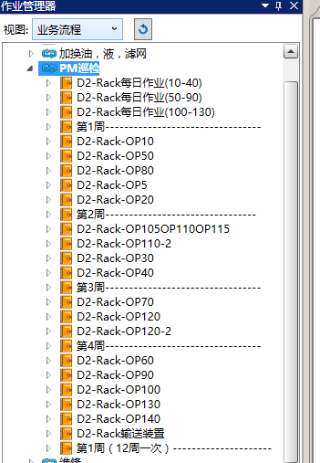
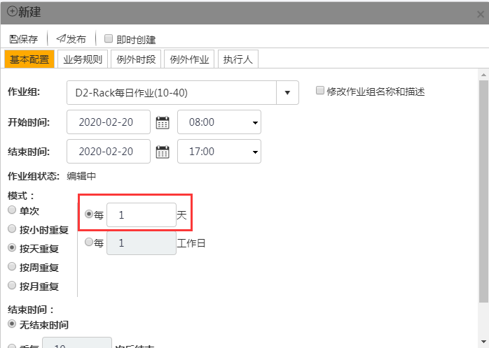
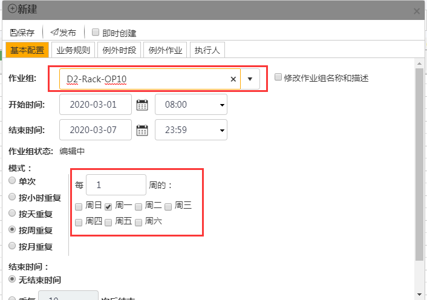
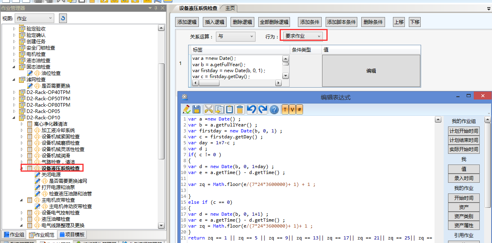
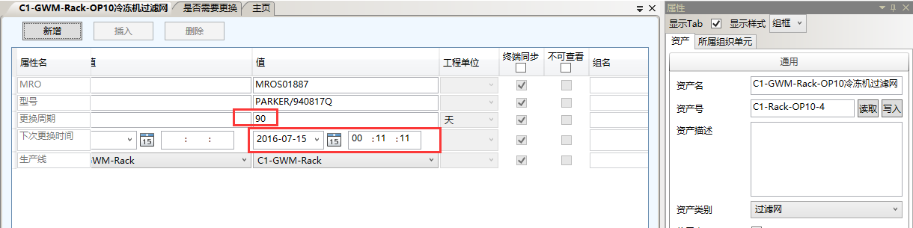
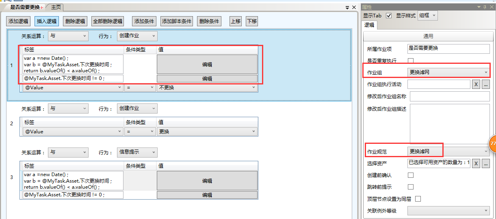

# 概述
注重于对设备的管理，有PM作业，TPM作业，定期润滑，定期更换滤网，计量器具的校准作业。
# # <span id="PM">PM作业</span>
主要是对设备的一些日常检查，比较基础，操作工就可以完成。

注意的就是计划重复的周期不同即可。
* 每日作业是安装天重复计划。

* 周作业是按月重复计划。作业时间为7天。

**重点：**
* 我们以D2-Rack-OP10作业组为例。计划重复周期为每周一次，但不是所有作业都是每周一次，有些作业是在**每年**的第1，5，9，13，17，21，25，29，33，37，41，45，49周执行。那就需要用到下面的脚本。

```
var a =new Date() ;
var b = a.getFullYear() ;
var firstday = new Date(b, 0, 1) ;
var c = firstday.getDay() ;
var day = 1+7-c ;
var d ;
if( c != 0 ) 
{
var d = new Date(b, 0, 1+day) ;
var e = a.getTime() - d.getTime() ;
var zq = Math.floor(e/(7*24*3600000)+ 1) + 1 ; 
}
else if (c == 0)
{
var d = new Date(b, 0, 1+1) ;
var e = a.getTime() - d.getTime() ;
var zq = Math.floor(e/(7*24*3600000)+ 1)+ 1 ; 
}
return zq == 1 || zq == 5 || zq == 9|| zq == 13|| zq == 17|| zq == 21|| zq == 25|| zq == 29|| zq == 33 || zq == 37|| zq == 41|| zq == 45|| zq == 49;
上述脚本能计算当前时间处于本年第几周，当变量*zq*处于这些周时，返还true;
```
* 当设备配件使用时间到达更换周期时，作业时需要提示更换并创建更换作业组。
我们以D2-Rack每日作业(10-40)作业组下D2-Rack-OP10冷冻机过滤网检查为例。D2-Rack-OP10冷冻机过滤网为系统资产，有资产属性*更换周期*，*下次更换时间*。

当作业时间超过*下次更换时间*时，那代表需要更换滤网，我们需要提醒执行人员进行更换。[创建更换滤网说明链接](#ghlw)

```
var a =new Date() ;
var b = @MyTask.Asset.下次更换时间 ;
return b.valueOf() < a.valueOf() ;
当作业时间超过*下次更换时间*时，返回true。
```
```
@MyTask.Asset.下次更换时间 != 0 ;
这个作业组属性*下次更换时间*不能为空。
```
# TPM作业组
同[PM作业组](#PM)的配置，计划时周期不同。

# <span id="ghlw">更换滤网作业组</span>


