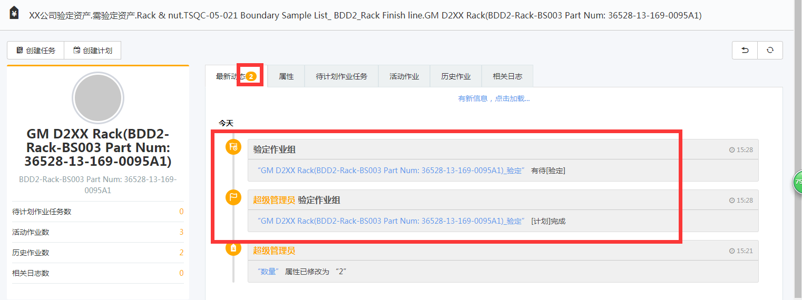

# 启用
启用后，处于一个局域网时，终端和EOC可接受系统配置的消息通知，如待执行通知或待审核通知。
# 启用资产作业消息  
启用后可在EOC资产总览里看到这个资产的作业情况，有新作业会有消息。

# RabbitMQ服务器内网IP 
安装RabbitMQ服务的电脑的内网IP地址。
# RabbitMQ用户名
RabbitMQ服务的访问登录名。
# RabbitMQ密码
RabbitMQ服务的访问密码。
# WebSocket服务器外网IP
安装IIS服务的服务器的外网地址
# WebSocket服务器外网端口
默认为6018.
# WebSocket服务器外网端口（SSL）
默认为9090.