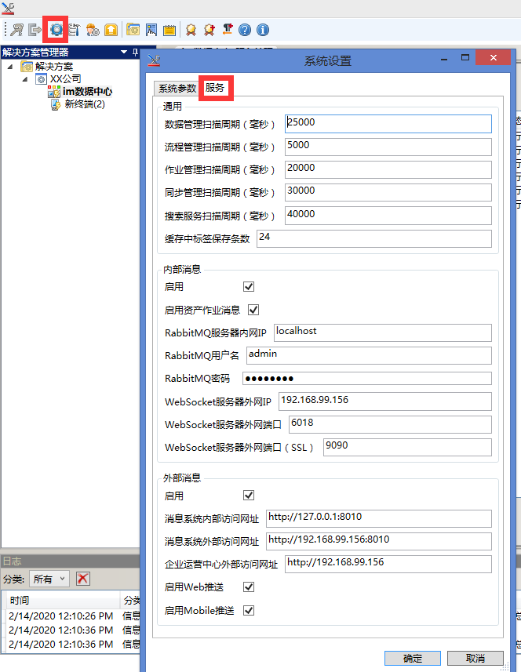
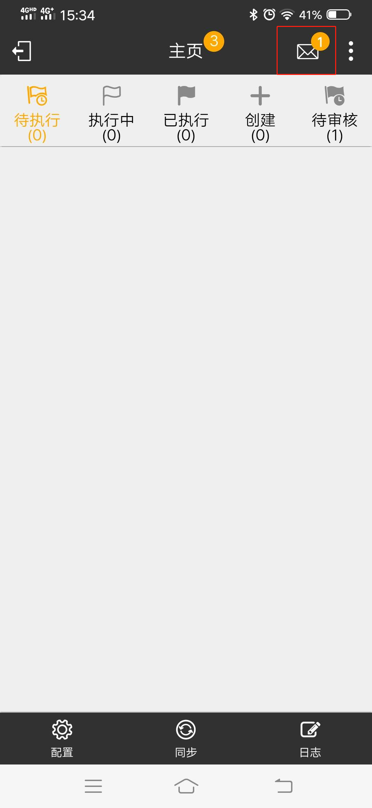

## 内部消息
* 启用
启用后，处于一个局域网时，终端和EOC可接受系统配置的消息通知，如待执行通知或待审核通知。
*  启用资产作业消息  
启用后可在EOC资产总览里看到这个资产的作业情况，有新作业会有消息。

* RabbitMQ服务器内网IP 
安装RabbitMQ服务的电脑的内网IP地址。
*  RabbitMQ用户名
RabbitMQ服务的访问登录名。
* RabbitMQ密码
RabbitMQ服务的访问密码。
*  WebSocket服务器外网IP
安装IIS服务的服务器的外网地址
*  WebSocket服务器外网端口
默认为6018.
*  WebSocket服务器外网端口（SSL）
默认为9090.
## 通用  
* 数据管理扫描周期（毫秒）
数据抽取，转换，装载以及归档的间歇时间。
* 流程管理扫描周期（毫秒）
流程活动转换的扫描时间，比如现在是*执行中*，最慢一个扫描周期会扫描下执行有没有结束是不是改推进到下一个活动。
* 作业管理扫描周期（毫秒）
计划创建后作业状态变化的扫描检测周期。
* 同步管理扫描周期（毫秒） 
终端是否有新作业，新消息的检测周期。
* 搜索服务扫描周期 
* 缓存中标签保存条数
## 外部消息
* 启用
启用后如服务器处于互联网中，终端和EOC也可以接受到系统推送的消息，如待执行通知或待审核通知。
* 消息系统内部访问地址
访问RabbitMQ服务的内网网站地址。
* 消息系统外部访问地址  
访问RabbitMQ服务的外网网站地址。
* 企业运营中心外部访问地址
EOC 网站访问的外网网站地址。
* 启用Web推送 
启用后EOC才可以接受到系统通知。
* 启用Mobile推送
启用后终端才可以接受到系统通知。
# 系统设置-服务设置位置
* 开始菜单-打开im解决方案开发中心

# 消息推送的显示结果
* 终端消息显示样式

* EOC消息显示样式

