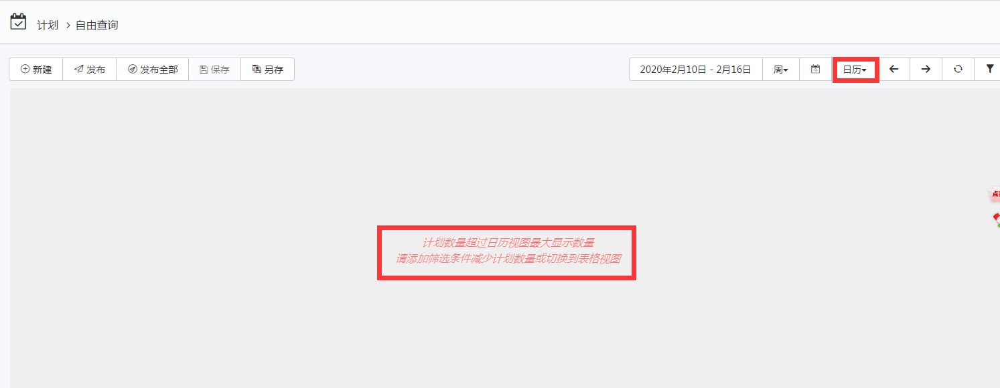

# 通用  
* SQl服务器超时（秒）
系统连接SQL服务的最长时间，超过错误。
* SQl执行超时（秒）
所以查询SQL数据库时语句执行最大时间。
* MongoDB链接超时（秒）
系统查询MONGODB数据库时超时最大用时。
* Http请求超时（秒）  
EOC打开页面显示最大用时，超过则报错。
* 树层次数组长度  
正常使用树结构功能的最大层数，如资产，资产类别，组织单元，人员。

* 日历视图最大显示数量  
EOC-计划日历显示的最大作业组计划的数量。  

* 启用SQl相关接口  
如果有自定义服务或者程序需要查询，修改数据库表格数据时，需启动此接口。
* 阿里云服务区域ID
默认空时默认使用上海艾动信息科技有限公司的阿里云服务区域ID。用于发送邮件或短信。  
用户可以使用自己的阿里云服务区域ID。
* 阿里云服务访问Keyid
同上。
* 阿里云服务密码访问Key  
同上。
