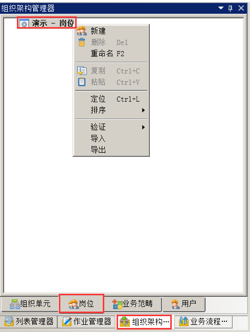
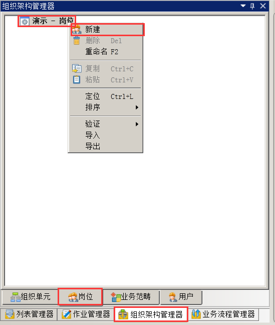
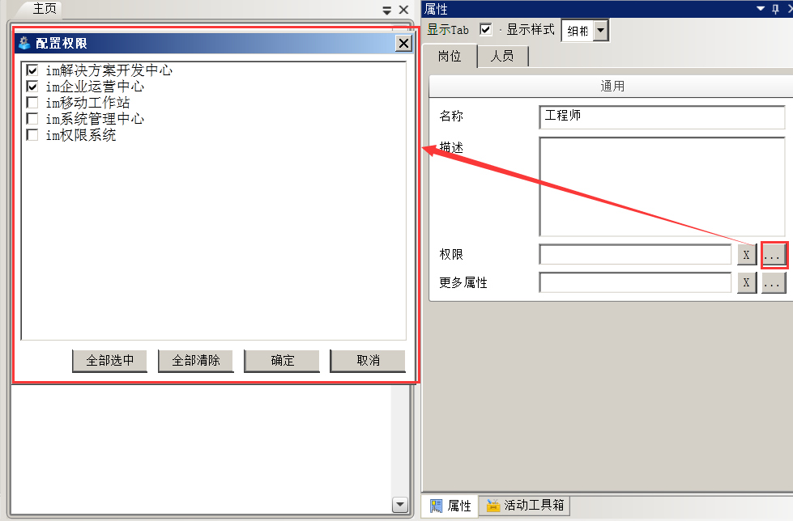
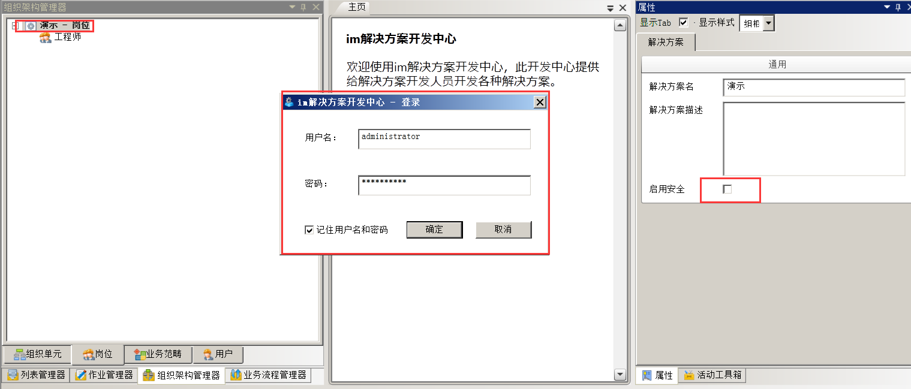
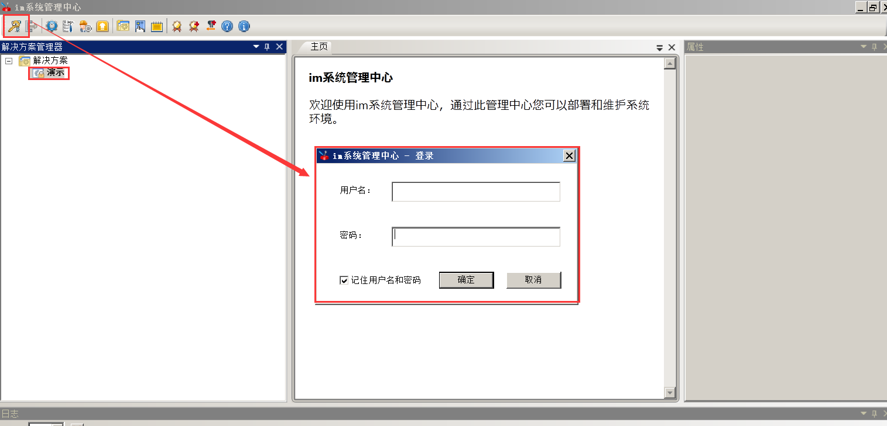
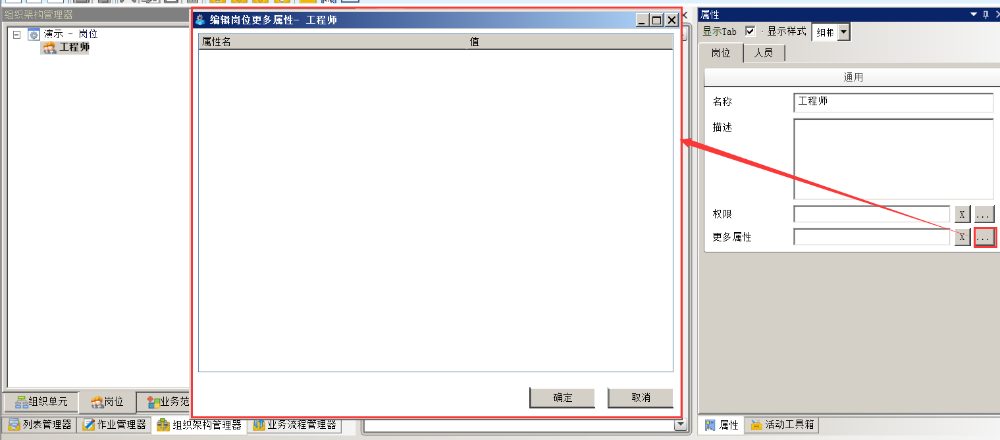

# 岗位
在imgenius企业移动现场作业管理软件中，使用**组织架构管理器**中的**岗位**选项卡进行**岗位**的定义。**岗位**是一个列表视图，**岗位**不能包含**岗位**。一个**岗位**对应一种软件使用权限。
## 配置岗位
在**导航栏→组织架构管理器→岗位**内右键演示-岗位，在快捷菜单中即可完成岗位的新建、删除、重命名、复制、粘贴、排序、验证、导入和导出操作。

## 新建岗位
在导航栏→组织架构管理器→岗位内选择我的应用-**岗位**，右击，在快捷菜单栏中选择新建。

* 选择新建的岗位，在右侧属性栏岗位配置窗口内配置（例如）：
  * **名称**：岗位名
  * **描述**：岗位描述。
  * **权限**：此岗位对应的软件使用权限。
  * **更多属性**：为岗位添加属性，在**全局属性模板**中**岗位属性模板**中配置。

* 配置岗位权限，单击进入配置权限，如图：

  * **im方案开发中心**：在该岗位的用户具备im开发中心的登录权限，可在开发中心创建、配置现场作业管理解决方案。
  * **im企业运营中心**：具备imgenius企业移动现场作业管理软件的门户网站登录权限。
  * **im移动工作站**：移动终端的用户登录权限：
  * **im系统管理中心**：管理整个系统的核心数据库，支持配置和运行的数据的权限。
  * **im权限系统**：具备设置权限分配的权限。

**注意**：权限配置仅在**解决方案**启用了安全以后有效。

选中解决方案名，在属性栏勾选启用安全，输入超级管理员用户名及密码，如图：

启用了安全的解决方案在启动解决方案开发中心时，将弹出登录验证对话框如图：

* 配置更多属性单击进入更多属性，如图：

**注意**：更多属性是不能在此直接配置的，需要前往**列表管理器-全局属性模板-岗位属性模板**中添加。