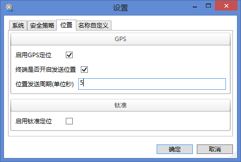
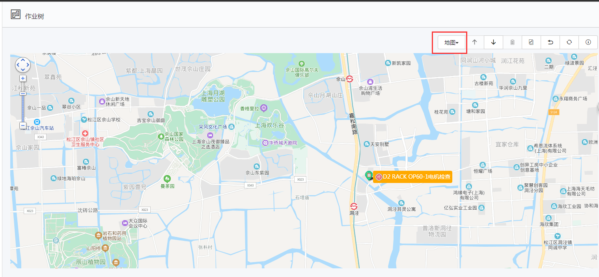
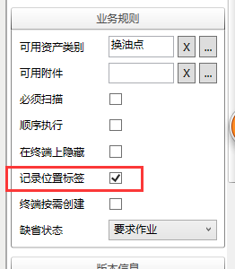
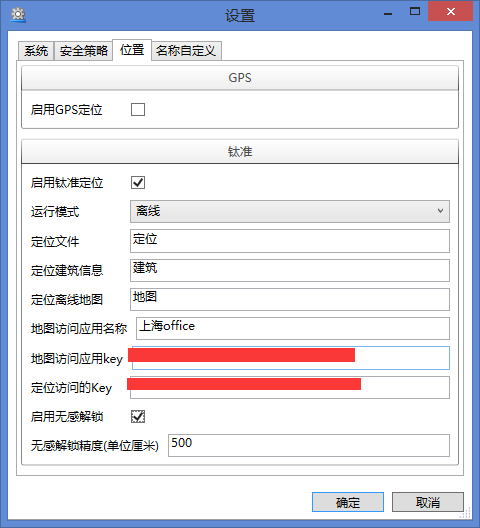
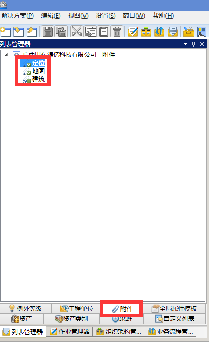
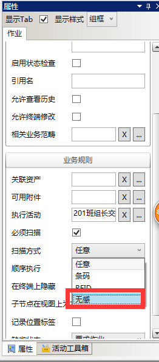
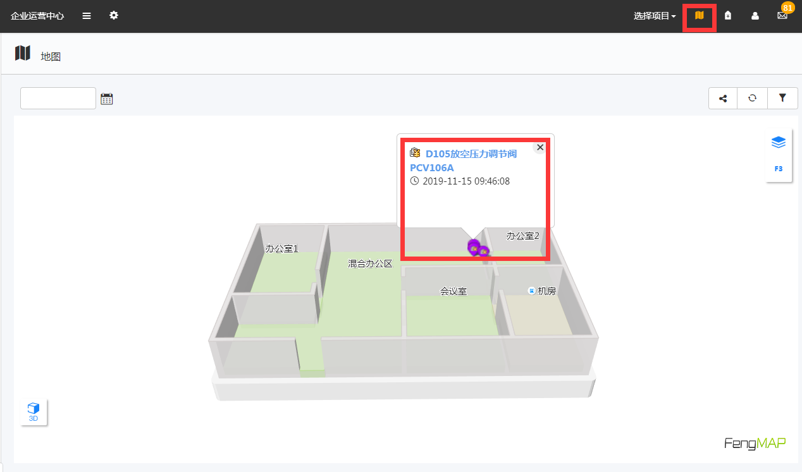

# 使用GPS定位，执行作业组时每个作业会在**百度地图**上标记获得GPS信号点。

## 作用
对于作业点间隔区域比较大的作业可以很清楚的勾画出作业轨迹，如石油管线巡线作业。
效果如下图：

*注意：配合作业组和作业上勾选记录位置标签*

# 启用钛准定位 

相比于GPS定位，精度更高但需要布置定位信标和基站并自行绘画场地图。
* 运行模式
离线是将定位所需文件下载到终端上，然后终端自行判断所处位置点。
在线是实时将终端获得的信息上传钛准服务器然后由钛准服务器将位置点传回imgenius服务器，再绘制成轨迹，位置等。
*现在只支持离线模式*
* 定位文件
钛准定位系统的文件，文件名为LocateDatas.zip。这些文件需先放入系统附件中，这里只需要写入附件的名称。

* 定位建筑信息 
钛准定位系统的文件，文件名为buildData.zip。同上。
* 定位离线地图
钛准定位系统的文件，文件名为FXXXXXX.zip。同上。
* 地图访问应用名称
钛准定位系统的蜂鸟地图应用名称。
* 地图访问的key
钛准定位系统的蜂鸟地图应用key。
* 定位访问的key
钛准定位系统的访问key。
* 启用无感解锁
当每个资产都已在imgenius系统中标记成位置点后，启用无感解锁后，当终端靠近这个位置点无感解锁精度（比如500cm），执行中的这个资产的作业会自动解锁变为可执行状态。
*注意1：需配合作业上的必须扫描功能（无感）一起使用*

*注意2：事先资产需录入钛准位置。*

