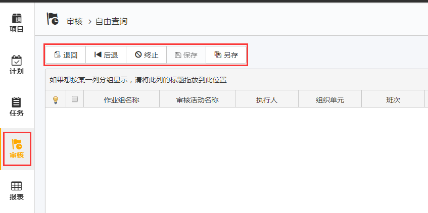
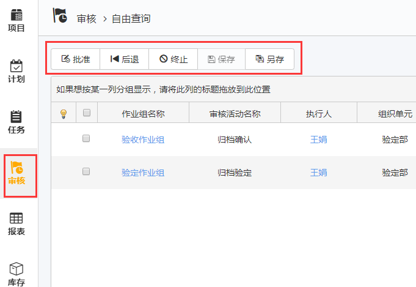
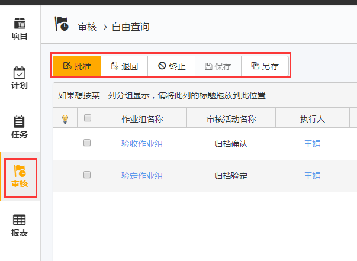
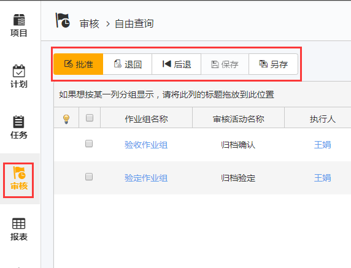
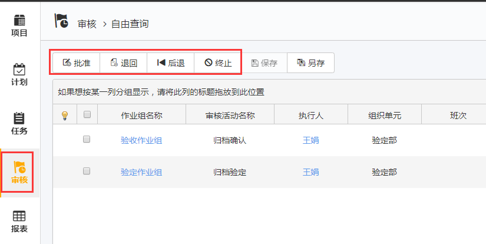
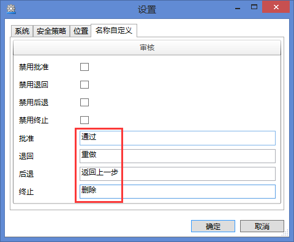
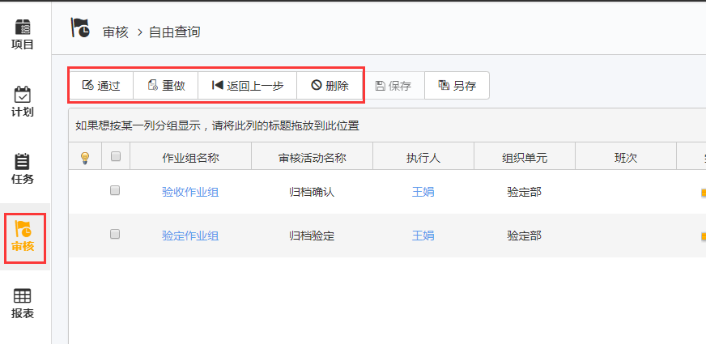

# 禁用批准
勾选此功能后，所有审核活动都不能点击*批准*按键。*批准*按键会消失。

# 禁用退回
勾选此功能后，所有审核活动都不能点击*退回*按键。*退回*按键会消失。

# 禁用后退
勾选此功能后，所有审核活动都不能点击*后退*按键。*后退*按键会消失。

# 禁用终止
勾选此功能后，所有审核活动都不能点击*禁用*按键。*禁用*按键会消失。

# 批准、退回、后退、终止
默认为空时，EOC审核里显示如下图。

如将配置里修改成下图所示。则EOC上会按照您修改的字符显示。

