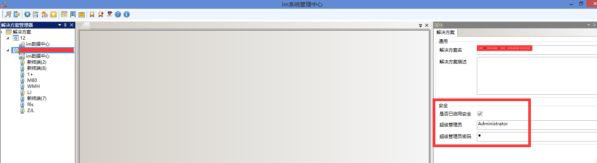

# 启用安全策略
默认不开启此功能。
## 密码过期天数
imgenius系统管理员密码和所有人员密码。设置后一个密码的过期天数。到期后必须更改密码。

## 开始提醒天数
设置后会在密码快到期前多少天，当您登陆系统时提醒*密码快过期*。
## 终端白名单
默认为空，所有终端都可登陆同步。
设置格式```[{'DeviceID':'862902048862498,862902048862480','LoginIDs':['登录名1','登录名2']},{'DeviceID':'867113030048097','LoginIDs':['登录名1','登录名2']}]```
设置成功后在指定的终端上，只有设定的登陆人可以登陆这个终端。