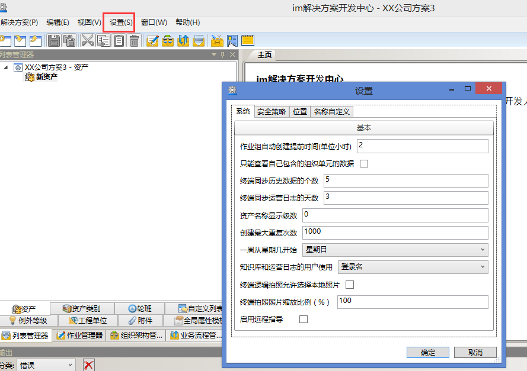

# 设置位置
打开开始菜单-im解决方案开发中心-设置。

# 系统
系统的一些参数配置，详见[系统设置](./系统.md)
# 安全策略
可以是系统的密码定期过期，可以设置指定的指定才能同步系统。详见[安全策略](./安全策略.md)
# 位置
支持终端GPS定位和钛准定位。详见[位置](./位置.md)
# 名称自定义
EOC审核界面时，可通过修改改变原有的固定名称或者禁用某些审核功能。详见[名称自定义](./名称自定义.md)