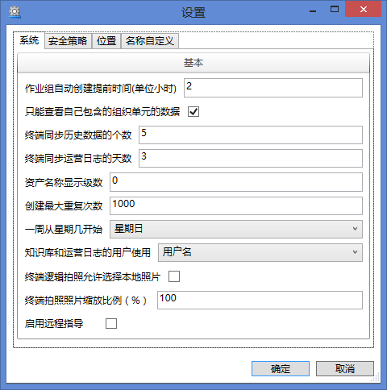
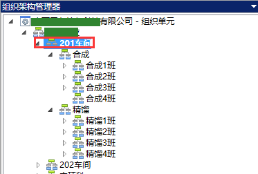
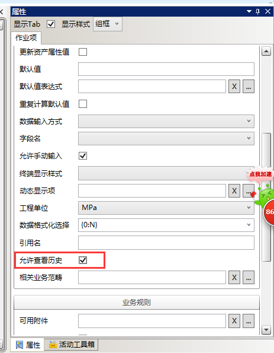
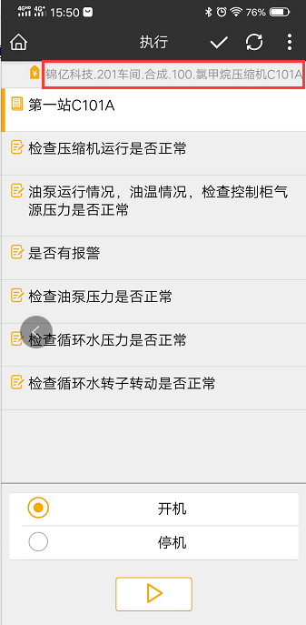
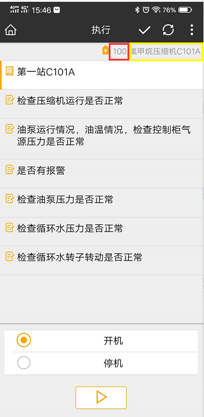
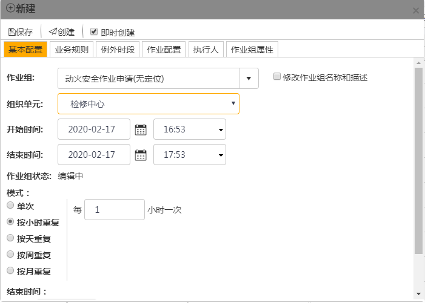
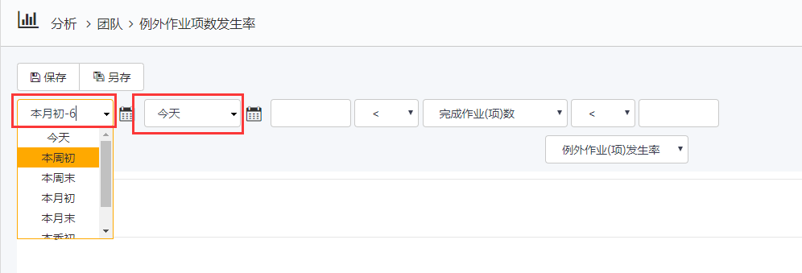
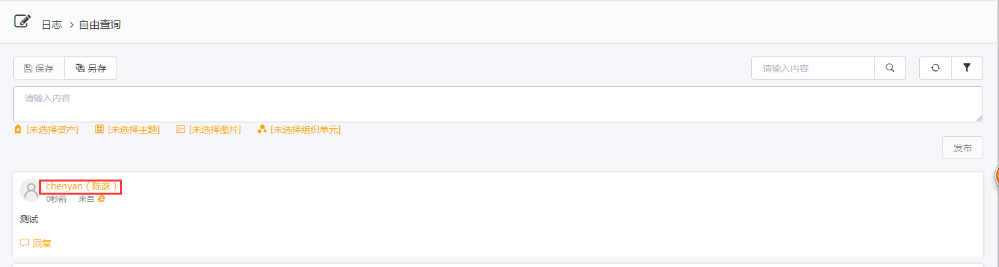
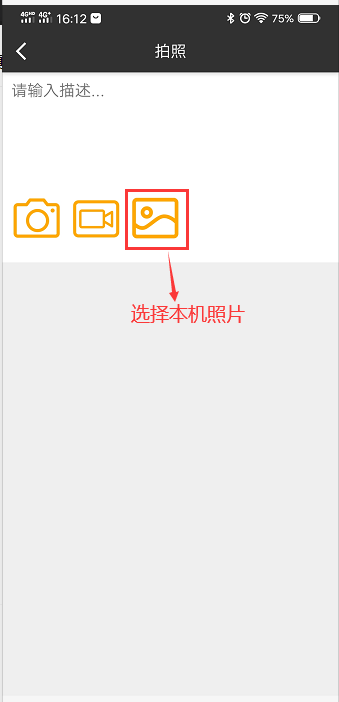

# 设置位置
打开im解决方案开发中心-设置

* 作业组自动创建提前时间（单位小时）
默认2小时，影响作业组的创建。如作业组计划开始时间为10：00，现在时间为6：00，则作业组颜色从现在一直到8点都为黄色，处于计划中，到8：00时，作业组状态会变为蓝色，也就是被创建出来了。
* 只能查看自己包含的组织单元的数据
影响EOC数据的查看。如张三是的组织单元是201车间，那只能看到201车间的下属（合成及其下属，精馏及其下属）的所属组织单元的作业组数据。不能看到202车间及其下属的作业组数据。

* 终端同步历史数据的个数
通常与作业项里的查看历史数据配合使用。默认值是5，指终端会将这一作业项的前5个值下载缓存到终端上。

* 终端同步运营日志的天数
终端日志功能同步日志的限制。默认值是3天，指终端**只能**将前3天至今发表的所有日志都会同步到终端上。
* 资产名称显示级数
资产是树形结构，所以在终端显示时可能因层级过多显示不全，这里可以根据需要控制显示的层级数。默认值为0，可以显示全部层级。

将其值修改为2.则如下图显示：

* 创建最大重复次数
EOC计划菜单-创建-重复创建系统能创建的最大数量的作业组数。

* 一周从星期几开始
影响EOC的查询和筛选功能，默认为周日开始，那么本周初就是周日开始。

* 知识库和运营日志的用户使用
日志上显示发布人的方式，默认只显示用户名。如果改成登录名（用户名），则如下图所示：

* 终端逻辑拍照允许选择本地照片
终端逻辑拍照时，默认不能选择本地照片（本机存储的照片），而只能现拍现用。
如果勾选上这个项，则多出一个选择本地照片的项，如下图：

* 逻辑拍照照片缩放比率（%）
默认值为100，代表保存终端拍照的所有像素，不进行压缩。
如设置为1，那酱原照片压缩到1%大小在上传。有利于增加上传下载速度。
* 启用远程指导
使用AR眼镜远程指导时启动此功能。