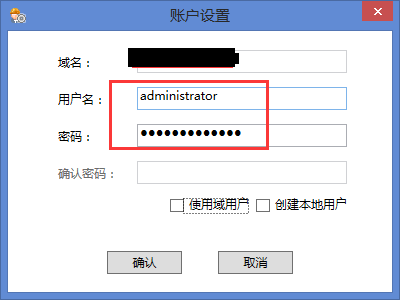
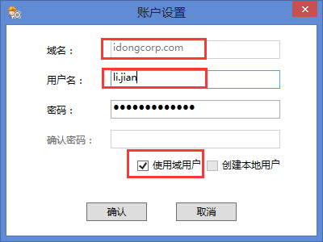
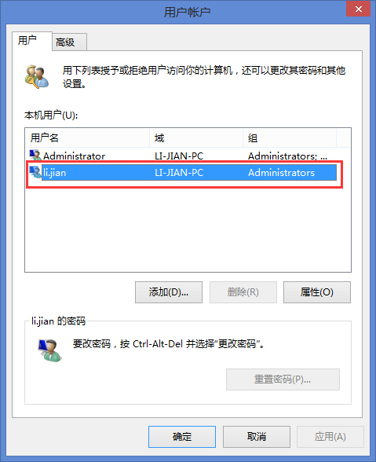

# 使用服务器内置管理员账户
通常一个电脑的内置管理员账户就是administrator，所以直接使用它即可。
*注意：有些新装电脑未开启内置管理员账户，所以可以先开启，再设置。*

# 使用域账户
如果服务器处在一个域中，那也可以使用域账户，域账户也要添加到这个计算机的administrator组中，在控制面板-用户账户里设置。

# 创建本地账户
创建一个临时的本地账户，然后将其设置为系统管理员和administrator组中。
*不推荐使用此方法。*