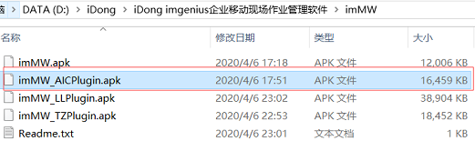
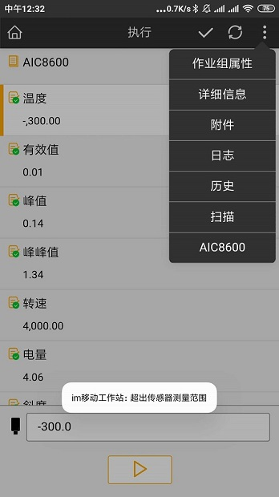

# 使用AIC8600测温测振设备

## 安装

* 使用AIC8600测温测针设备进行作业，需要先安装支持AIC8600的apk。在imgenius3.8.2安装包中，找到并安装即可。

  

## 使用

* 首先要在SDC中配置好数据输入方式为AIC8600的相关内容。如作业项、作业组属性选择了支持输入方式为AIC8600的数据类型，配置好检测的字段。

* 打开im移动工作站，同步拿到作业组之后就可以进入到AIC8600的检测详情页面，同时点击右上角菜单栏中的AIC8600也可以进入。

  

* 进入AIC8600详情页面后，首先需要点击搜索所有，这将开启蓝牙并搜索，勾选上设备，点击开始即可开始测量。点击停止，则停止测量；点击改名，可修改设备蓝牙名称；点击返回，回到移动工作站执行页面，并且点击下一步，测量出的各项状态值会自动填写进对应的作业内容中，并实时改变。

  

  * 状态值中可以看到实时监测到的各项状态值
  * 曲线图中展示了状态值的曲线效果图
  * 日志中实时显示了环境温度相关的信息
  * 设置里可以勾选上温暖曲线的校准，输出环境温度信息日志（勾选上之后，只可以测量温度）

## 字段名/状态值说明

* 温度：测量对象的温度。
* 有效值：就是均方根值，根据电流热效应来规定，用以计量交流电大小的值交流电通过某电阻，在一周期内所产生的热量与直流电通过该电阻在同样时间内产生的热量相等，此直流电的量值则是该交流电的有效值。
* 峰值：变化的电流、电压或功率的最大瞬间值；简单来说就是起伏变化的数值中的最大值。
* 峰峰值：峰峰值是指一个周期内信号最高值和最低值之间差的值，就是最大和最小之间的范围。
* 转速：即做圆周运动的物体单位时间沿圆周绕圆心转过的圈数。
* 电量：测量到的电量值。
* 斜度：反映对纵坐标的不对称性，如果越大，不对称越厉害。
* 峭度：峭度是把幅值进行四次方处理，一个脉冲信号按四次方关系变化后，高的幅值就被突出来，而低的幅值被抑制，这样就很容易从频率上识别故障。
* 波形指标：均方根值除以绝对平均值。
* 脉冲指标：即峰值除以绝对平均值，用来检测信号中是否存在冲击振动。
* 裕度指标：一般用于检测机械设备的磨损情况。若歪度指标变化不大，有效值与平均值的比值增大，说明由于磨损导致间隙增大，因而振动的能量指标有效值比平均值增加快，其裕度指标也增大了。
* 全部：数据类型为Json字符串，数据格式中新增属性为以上状态值。
