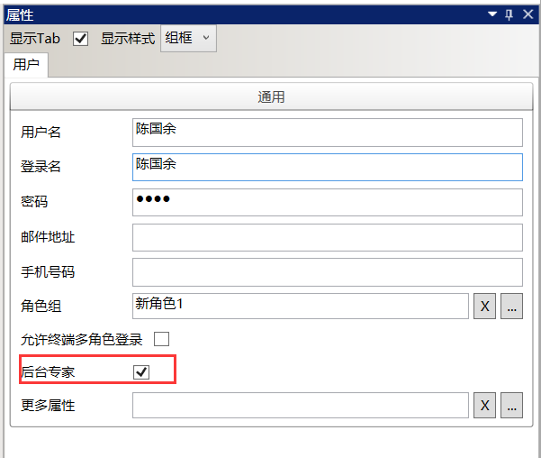

# 使用AR智能眼镜和远程指导

## 远程指导
* SDC设置中`启用远程指导`功能
    
* SDC中给指定人员勾上`后台专家`权限
    
* PDA安装亮亮插件版移动工作站`imMW_LLPlugin.apk`
* PDA登录后，发起`远程指导`请求
    
    注意，作业组执行中发起时，此次远程指导将绑定当前作业组。
* 后台专家登录EOC后点击`远程指导`按钮
    
