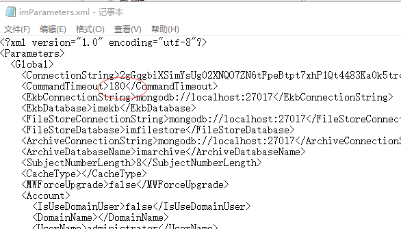

## 一. 手机端-不能同步或发送同步命令失败

1. 首先检查软件-配置-服务器IP地址是否正确，端口是否为8090

2. 打开手机浏览器，输入服务器IP地址，看能否打开网站（下图）并且能够用有权限或者能审核的人登陆。如果不能登陆能说明手机网络有问题。

3. 如果手机网络没有问题，但是软件不能同步，请用电脑telnet 服务器IP地址:8090。

4. telnet不通，请远程服务器查看开始im系统管理中心-6大服务是否开启。没有开启请右击数据中心-撤销部署-部署，将服务状态改为运行中。

5. 六大服务如果都开启的，请联系IT部门解决服务器8090端口问题。

## 二. 网站-打不开

1. 确定输入地址为服务器IP地址，浏览器为谷歌或者火狐。（不完全支持IE，360，2345等浏览器）

2. 请打开cmd ping 服务器IP地址 -t ，没有响应请联系锦亿机动科部门解决网络问题

3. 如果有回应请远程服务器查看开始-IM系统管理中心-6大服务是否开启。没有开启请右击数据中心-撤销部署-部署，将服务状态改为运行中。

## 三. 部署错误

**现象：** 在恢复数据库后，在SMC上部署数据中心时会报错（错误与下图相同）

**解决办法：** 重新创建用户，不要使用域用户。

**Win10系统：** 控制面板-程序-打开或关闭windows功能，打开IISasp

电脑→管理→本地用户和组→administrator（属性里禁用去掉，修改密码），用此登录SMC，再部署。

**Win8系统：** 开启administrator用户。

搜索-cmd-已管理员身份运行-net user administrator 密码  /active:yes   （net user administrator /active:no关闭）

## 四. 还原数据库正常部署后，EOC无法登陆

**现象：** 还原数据库正常部署后，EOC无法登陆，提示：没有部署任何解决方案

**解决办法：** 

1. 用im部署工具重新部署，并重启IIS

2. 重启服务，重启数据库

3. 进入数据库，选中当前数据库，右击，属性，进入到数据库属性界面，选中选项，将Broker 的值修改为 True，如图：

确定后重启数据库，完成。

## 五. 部署完毕后EOC显示异常

部署完毕之后，登录EOC，会有异常显示和错误提示。

**问题分析：** iis安装错误导致

**解决办法：** 重新安装iis

